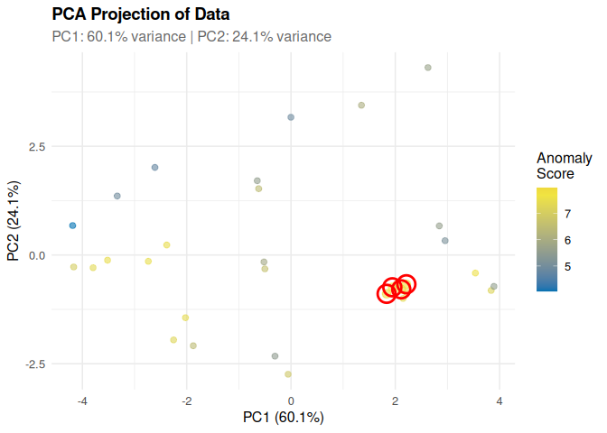

<!-- README.md is generated from README.Rmd. Please edit that file -->

# outlieR

<!-- badges: start -->

<!-- badges: end -->

> Automatic Outlier Detection Using Isolation Forests

## Overview

`outlieR` provides a simple, powerful API for automatic outlier
detection in tabular data. The package uses Isolation Forests (via
`isotree`) with automatic hyperparameter tuning and delivers detailed
feature-level diagnostics.

### Main Features

✨ **Simple API** - One function for most use cases 🎯 **Automatic
Tuning** - Grid Search, Random Search, or Bayesian Optimization 📊
**Detailed Diagnostics** - Feature-level outlier analysis 📈
**Comprehensive Visualizations** - Score plots, feature importance, PCA
projection 🔧 **Flexible** - Supports numeric and categorical variables

## Installation

``` r
# Install from GitHub (development version)
# install.packages("remotes")
remotes::install_github("fabiandistler/outlieR")

# Install from CRAN (once available)
# install.packages("outlieR")
```

## Quick Start

``` r
library(outlieR)

# Basic usage: Automatic outlier detection
result <- detect_outliers(mtcars)
#> ℹ Preprocessing data...
#> ℹ Tuning hyperparameters using grid search...
#> ℹ Testing 16 parameter combinations...
#> ✔ Best parameters found:
#> • ntrees: 100
#> • sample_size: 32
#> • max_depth: 12
#> • ndim: 2
#> ℹ Training isolation forest model...
#> ℹ Computing anomaly scores...
#> ✔ Detected 4 outliers (12.5% of data)
#> ✔ Outlier detection complete!

# Display results
print(result)
#> 
#> === Outlier Detection Results ===
#> 
#> Model Configuration:
#>   - Algorithm: Isolation Forest (isotree)
#>   - Number of trees: 100 
#>   - Sample size: 32 
#>   - Max depth: 12 
#> 
#> Detection Summary:
#>   - Total observations: 32 
#>   - Outliers detected: 4 ( 12.5 %)
#>   - Anomaly score threshold: 8.1405 
#> 
#> Performance Metrics:
#>   - mean_score : 6.5564 
#>   - median_score : 6.7492 
#>   - sd_score : 1.2908 
#>   - min_score : 3.91 
#>   - max_score : 8.4067 
#>   - mean_outlier_score : 8.2838 
#>   - mean_normal_score : 6.3096 
#>   - cohens_d : 2.3444 
#>   - outlier_separation : 1.5295 
#>   - detection_rate : 0.125 
#>   - expected_contamination : 0.1 
#>   - actual_contamination : 0.125 
#> 
#> Use plot() to visualize results
#> Use get_outlier_summary() to see detailed outlier information
summary(result)
#> 
#> === Outlier Detection Results ===
#> 
#> Model Configuration:
#>   - Algorithm: Isolation Forest (isotree)
#>   - Number of trees: 100 
#>   - Sample size: 32 
#>   - Max depth: 12 
#> 
#> Detection Summary:
#>   - Total observations: 32 
#>   - Outliers detected: 4 ( 12.5 %)
#>   - Anomaly score threshold: 8.1405 
#> 
#> Performance Metrics:
#>   - mean_score : 6.5564 
#>   - median_score : 6.7492 
#>   - sd_score : 1.2908 
#>   - min_score : 3.91 
#>   - max_score : 8.4067 
#>   - mean_outlier_score : 8.2838 
#>   - mean_normal_score : 6.3096 
#>   - cohens_d : 2.3444 
#>   - outlier_separation : 1.5295 
#>   - detection_rate : 0.125 
#>   - expected_contamination : 0.1 
#>   - actual_contamination : 0.125 
#> 
#> Use plot() to visualize results
#> Use get_outlier_summary() to see detailed outlier information
#> 
#> Top 10 Outliers:
#>    row_id anomaly_score n_outlier_features
#>     <int>         <num>              <int>
#> 1:     23      8.406667                  0
#> 2:     12      8.296667                  0
#> 3:     14      8.290000                  0
#> 4:      3      8.141667                  0

# Extract outlier details
outlier_summary <- get_outlier_summary(result)
head(outlier_summary)
#>    row_id anomaly_score is_outlier feat_score_mpg feat_score_cyl
#>     <int>         <num>     <lgcl>          <num>          <num>
#> 1:     23      8.406667       TRUE      0.7391680      0.6744908
#> 2:     12      8.296667       TRUE      0.5174176      0.6744908
#> 3:     14      8.290000       TRUE      0.7391680      0.6744908
#> 4:      3      8.141667       TRUE      0.6652512      0.6744908
#>    feat_score_disp feat_score_hp feat_score_drat feat_score_wt feat_score_qsec
#>              <num>         <num>           <num>         <num>           <num>
#> 1:       0.7666771     0.3502164       0.7738894     0.1433700       0.2895719
#> 2:       0.5659316     0.7393456       0.8874878     0.9710060       0.2189446
#> 3:       0.5659316     0.7393456       0.8874878     0.5930305       0.2048192
#> 4:       0.6285756     0.3891293       0.2200970     1.3098806       0.6356457
#>    feat_score_vs feat_score_am feat_score_gear feat_score_carb
#>            <num>         <num>           <num>           <num>
#> 1:             0             0       0.6744908       0.0000000
#> 2:             0             0       0.6744908       0.6744908
#> 3:             0             0       0.6744908       0.6744908
#> 4:             0             0       0.0000000       0.6744908
#>    n_outlier_features top_outlier_features   mpg   cyl  disp    hp  drat    wt
#>                 <int>               <char> <num> <num> <num> <num> <num> <num>
#> 1:                  0      drat, disp, mpg  15.2     8 304.0   150  3.15 3.435
#> 2:                  0         wt, drat, hp  16.4     8 275.8   180  3.07 4.070
#> 3:                  0        drat, hp, mpg  15.2     8 275.8   180  3.07 3.780
#> 4:                  0        wt, cyl, carb  22.8     4 108.0    93  3.85 2.320
#>     qsec    vs    am  gear  carb
#>    <num> <num> <num> <num> <num>
#> 1: 17.30     0     0     3     2
#> 2: 17.40     0     0     3     3
#> 3: 18.00     0     0     3     3
#> 4: 18.61     1     1     4     1

# Create visualizations
plot(result, type = "score") # Score distribution
```


``` r
plot(result, type = "features") # Feature importance
```


``` r
plot(result, type = "pca") # PCA projection
```



## Detailed Examples

### 1. Analyze specific columns

``` r
# Use only selected variables
result <- detect_outliers(
  data = iris,
  target_cols = c("Sepal.Length", "Sepal.Width", "Petal.Length"),
  contamination = 0.05 # Expect 5% outliers
)
#> ℹ Preprocessing data...
#> ℹ Tuning hyperparameters using grid search...
#> ℹ Testing 16 parameter combinations...
#> ✔ Best parameters found:
#> • ntrees: 100
#> • sample_size: 150
#> • max_depth: 12
#> • ndim: 1
#> ℹ Training isolation forest model...
#> Warning in (function (data, sample_size = min(nrow(data), 10000L), ntrees =
#> 500, : Passed parameters for deterministic single-variable splits with no
#> sub-sampling. Every tree fitted will end up doing exactly the same splits. It's
#> recommended to set non-random split probabilities to less than 1, or to use the
#> extended model (ndim > 1).
#> ℹ Computing anomaly scores...
#> ✔ Detected 8 outliers (5.33% of data)
#> ✔ Outlier detection complete!
```

### 2. Without automatic tuning

``` r
# Manually specify parameters for more control
result <- detect_outliers(
  data = mtcars,
  tune = FALSE,
  n_trees = 200,
  max_depth = 12,
  sample_size = 512
)
#> ℹ Preprocessing data...
#> ℹ Training isolation forest model...
#> Warning in (function (data, sample_size = min(nrow(data), 10000L), ntrees =
#> 500, : 'sample_size' is larger than the number of rows in 'data', will be
#> decreased.
#> Warning in (function (data, sample_size = min(nrow(data), 10000L), ntrees =
#> 500, : Passed parameters for deterministic single-variable splits with no
#> sub-sampling. Every tree fitted will end up doing exactly the same splits. It's
#> recommended to set non-random split probabilities to less than 1, or to use the
#> extended model (ndim > 1).
#> ℹ Computing anomaly scores...
#> ✔ Detected 4 outliers (12.5% of data)
#> ✔ Outlier detection complete!
```

### 3. Different tuning methods

``` r
# Grid Search (default, systematic but slower)
result_grid <- detect_outliers(mtcars, tune_method = "grid")

# Random Search (faster, good results)
result_random <- detect_outliers(mtcars, tune_method = "random")

# Bayesian Optimization (experimental)
result_bayes <- detect_outliers(mtcars, tune_method = "bayesian")
```

### 4. With categorical variables

``` r
# Automatic one-hot encoding of factors
set.seed(42)
data <- data.frame(
  value1 = rnorm(100),
  value2 = rnorm(100),
  category = sample(c("A", "B", "C"), 100, replace = TRUE)
)

result <- detect_outliers(data)
#> ℹ Preprocessing data...
#> ℹ Encoding 1 categorical column...
#> ℹ Tuning hyperparameters using grid search...
#> ℹ Testing 16 parameter combinations...
#> ✔ Best parameters found:
#> • ntrees: 200
#> • sample_size: 100
#> • max_depth: 12
#> • ndim: 2
#> ℹ Training isolation forest model...
#> ℹ Computing anomaly scores...
#> ✔ Detected 10 outliers (10% of data)
#> ✔ Outlier detection complete!
```

### 5. Detailed outlier analysis

``` r
result <- detect_outliers(mtcars)
#> ℹ Preprocessing data...
#> ℹ Tuning hyperparameters using grid search...
#> ℹ Testing 16 parameter combinations...
#> ✔ Best parameters found:
#> • ntrees: 100
#> • sample_size: 32
#> • max_depth: 12
#> • ndim: 2
#> ℹ Training isolation forest model...
#> ℹ Computing anomaly scores...
#> ✔ Detected 4 outliers (12.5% of data)
#> ✔ Outlier detection complete!

# Which features are suspicious in row 31?
detailed <- get_outlier_summary(result, detailed = TRUE)
detailed[row_id == 31]
#> Empty data.table (0 rows and 27 cols): row_id,anomaly_score,is_outlier,feat_score_mpg,feat_score_cyl,feat_score_disp...
```

## Performance

``` r
# Benchmark on different data sizes
library(bench)

# Small dataset (1000 rows)
small_data <- data.frame(matrix(rnorm(1000 * 10), ncol = 10))
mark(detect_outliers(small_data, tune = FALSE))
# ~500ms

# Medium dataset (10000 rows)
medium_data <- data.frame(matrix(rnorm(10000 * 10), ncol = 10))
mark(detect_outliers(medium_data, tune = FALSE))
# ~2s

# With tuning (slower but better results)
mark(detect_outliers(medium_data, tune = TRUE, tune_method = "random"))
# ~20s (parallel on 4 cores)
```

## Advanced Usage

### Custom Threshold

``` r
result <- detect_outliers(mtcars, contamination = 0.05)

# Use a custom threshold
custom_threshold <- quantile(result$scores, 0.99)
custom_outliers <- result$scores > custom_threshold

# Generate new details
result$outliers <- custom_outliers
result$threshold <- custom_threshold
```

## Troubleshooting

### Too many/few outliers

``` r
# Adjust contamination parameter
result <- detect_outliers(data, contamination = 0.05) # Fewer outliers
result <- detect_outliers(data, contamination = 0.15) # More outliers
```

### Poor separation

``` r
# Use more trees
result <- detect_outliers(data, n_trees = 300)

# Enable tuning for better parameters
result <- detect_outliers(data, tune = TRUE, tune_method = "random")
```

### Memory issues with large data

``` r
# Disable parallel processing
result <- detect_outliers(large_data, parallel = FALSE)

# Fewer trees
result <- detect_outliers(large_data, n_trees = 50, tune = FALSE)
```

## Contributing

Contributions are welcome! Please:

1.  Fork the repository
2.  Create a feature branch (`git checkout -b feature/AmazingFeature`)
3.  Commit your changes (`git commit -m 'Add some AmazingFeature'`)
4.  Push to the branch (`git push origin feature/AmazingFeature`)
5.  Open a pull request

## License

MIT License – see [LICENSE](LICENSE) file for details.

## Acknowledgements

- `isotree` package for the Isolation Forest implementation
- R community for feedback and inspiration
