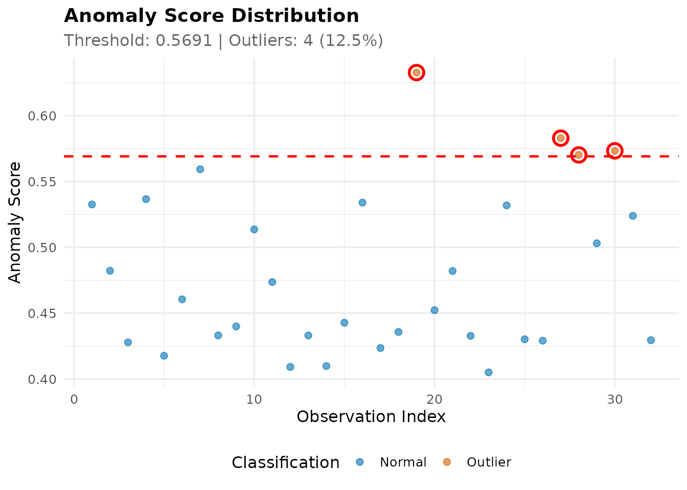
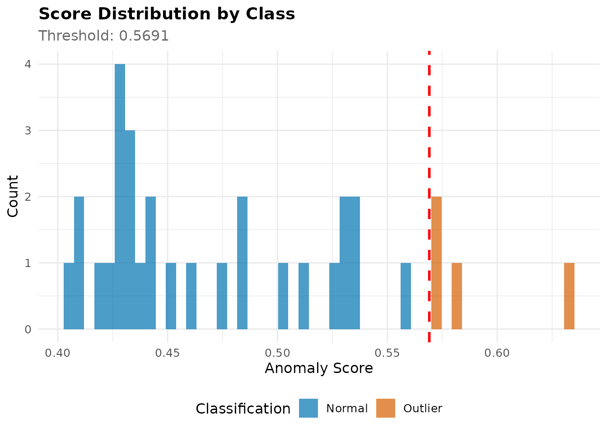

# Getting Started with outlieR

## Introduction

`outlieR` provides a simple yet powerful interface for automatic outlier
detection in tabular data. The package leverages Isolation Forests via
the `isotree` package and extends it with:

- **Automatic hyperparameter tuning**
- **Detailed feature-level analysis**
- **Comprehensive visualizations**
- **data.table-based performance**

### Installation

``` r
# Development version from GitHub
remotes::install_github("fabiandistler/outlieR")

# CRAN (once available)
install.packages("outlieR")
```

``` r
library(outlieR)
```

## Basic Usage

### Simplest Example

The main function
[`detect_outliers()`](https://fabiandistler.github.io/outlieR/reference/detect_outliers.md)
makes it extremely easy to find outliers:

``` r
# Standard usage with mtcars dataset
result <- detect_outliers(mtcars, verbose = FALSE, parallel = FALSE)
#> Warning in (function (data, sample_size = min(nrow(data), 10000L), ntrees =
#> 500, : Passed parameters for deterministic single-variable splits with no
#> sub-sampling. Every tree fitted will end up doing exactly the same splits. It's
#> recommended to set non-random split probabilities to less than 1, or to use the
#> extended model (ndim > 1).
#> Warning in (function (data, sample_size = min(nrow(data), 10000L), ntrees =
#> 500, : Passed parameters for deterministic single-variable splits with no
#> sub-sampling. Every tree fitted will end up doing exactly the same splits. It's
#> recommended to set non-random split probabilities to less than 1, or to use the
#> extended model (ndim > 1).
#> Warning in (function (data, sample_size = min(nrow(data), 10000L), ntrees =
#> 500, : Passed parameters for deterministic single-variable splits with no
#> sub-sampling. Every tree fitted will end up doing exactly the same splits. It's
#> recommended to set non-random split probabilities to less than 1, or to use the
#> extended model (ndim > 1).
#> Warning in (function (data, sample_size = min(nrow(data), 10000L), ntrees =
#> 500, : Split type probabilities sum to more than 1, will standardize them
#> Warning in (function (data, sample_size = min(nrow(data), 10000L), ntrees =
#> 500, : Split type probabilities sum to more than 1, will standardize them
#> Warning in (function (data, sample_size = min(nrow(data), 10000L), ntrees =
#> 500, : Split type probabilities sum to more than 1, will standardize them
#> Warning in (function (data, sample_size = min(nrow(data), 10000L), ntrees =
#> 500, : Split type probabilities sum to more than 1, will standardize them
#> Warning in (function (data, sample_size = min(nrow(data), 10000L), ntrees =
#> 500, : Split type probabilities sum to more than 1, will standardize them
#> Warning in (function (data, sample_size = min(nrow(data), 10000L), ntrees =
#> 500, : Split type probabilities sum to more than 1, will standardize them
#> Warning in (function (data, sample_size = min(nrow(data), 10000L), ntrees =
#> 500, : Split type probabilities sum to more than 1, will standardize them
#> Warning in (function (data, sample_size = min(nrow(data), 10000L), ntrees =
#> 500, : Split type probabilities sum to more than 1, will standardize them
#> Warning in (function (data, sample_size = min(nrow(data), 10000L), ntrees =
#> 500, : Split type probabilities sum to more than 1, will standardize them
#> Warning in (function (data, sample_size = min(nrow(data), 10000L), ntrees =
#> 500, : Split type probabilities sum to more than 1, will standardize them
#> Warning in (function (data, sample_size = min(nrow(data), 10000L), ntrees =
#> 500, : Split type probabilities sum to more than 1, will standardize them
#> Warning in (function (data, sample_size = min(nrow(data), 10000L), ntrees =
#> 500, : Split type probabilities sum to more than 1, will standardize them
#> Warning in (function (data, sample_size = min(nrow(data), 10000L), ntrees =
#> 500, : Split type probabilities sum to more than 1, will standardize them
#> Warning in (function (data, sample_size = min(nrow(data), 10000L), ntrees =
#> 500, : Split type probabilities sum to more than 1, will standardize them
#> Warning in (function (data, sample_size = min(nrow(data), 10000L), ntrees =
#> 500, : Split type probabilities sum to more than 1, will standardize them
#> Warning in (function (data, sample_size = min(nrow(data), 10000L), ntrees =
#> 500, : Split type probabilities sum to more than 1, will standardize them
#> Warning in (function (data, sample_size = min(nrow(data), 10000L), ntrees =
#> 500, : Split type probabilities sum to more than 1, will standardize them
#> Warning in (function (data, sample_size = min(nrow(data), 10000L), ntrees =
#> 500, : Split type probabilities sum to more than 1, will standardize them
#> Warning in (function (data, sample_size = min(nrow(data), 10000L), ntrees =
#> 500, : Passed parameters for deterministic single-variable splits with no
#> sub-sampling. Every tree fitted will end up doing exactly the same splits. It's
#> recommended to set non-random split probabilities to less than 1, or to use the
#> extended model (ndim > 1).
#> Warning in (function (data, sample_size = min(nrow(data), 10000L), ntrees =
#> 500, : Passed parameters for deterministic single-variable splits with no
#> sub-sampling. Every tree fitted will end up doing exactly the same splits. It's
#> recommended to set non-random split probabilities to less than 1, or to use the
#> extended model (ndim > 1).
#> Warning in (function (data, sample_size = min(nrow(data), 10000L), ntrees =
#> 500, : Passed parameters for deterministic single-variable splits with no
#> sub-sampling. Every tree fitted will end up doing exactly the same splits. It's
#> recommended to set non-random split probabilities to less than 1, or to use the
#> extended model (ndim > 1).
#> Warning in (function (data, sample_size = min(nrow(data), 10000L), ntrees =
#> 500, : Split type probabilities sum to more than 1, will standardize them
#> Warning in (function (data, sample_size = min(nrow(data), 10000L), ntrees =
#> 500, : Split type probabilities sum to more than 1, will standardize them
#> Warning in (function (data, sample_size = min(nrow(data), 10000L), ntrees =
#> 500, : Split type probabilities sum to more than 1, will standardize them
#> Warning in (function (data, sample_size = min(nrow(data), 10000L), ntrees =
#> 500, : Split type probabilities sum to more than 1, will standardize them
#> Warning in (function (data, sample_size = min(nrow(data), 10000L), ntrees =
#> 500, : Split type probabilities sum to more than 1, will standardize them
#> Warning in (function (data, sample_size = min(nrow(data), 10000L), ntrees =
#> 500, : Split type probabilities sum to more than 1, will standardize them
#> Warning in (function (data, sample_size = min(nrow(data), 10000L), ntrees =
#> 500, : Split type probabilities sum to more than 1, will standardize them
#> Warning in (function (data, sample_size = min(nrow(data), 10000L), ntrees =
#> 500, : Split type probabilities sum to more than 1, will standardize them
#> Warning in (function (data, sample_size = min(nrow(data), 10000L), ntrees =
#> 500, : Split type probabilities sum to more than 1, will standardize them
#> Warning in (function (data, sample_size = min(nrow(data), 10000L), ntrees =
#> 500, : Split type probabilities sum to more than 1, will standardize them
#> Warning in (function (data, sample_size = min(nrow(data), 10000L), ntrees =
#> 500, : Split type probabilities sum to more than 1, will standardize them
#> Warning in (function (data, sample_size = min(nrow(data), 10000L), ntrees =
#> 500, : Split type probabilities sum to more than 1, will standardize them
#> Warning in (function (data, sample_size = min(nrow(data), 10000L), ntrees =
#> 500, : Passed parameters for deterministic single-variable splits with no
#> sub-sampling. Every tree fitted will end up doing exactly the same splits. It's
#> recommended to set non-random split probabilities to less than 1, or to use the
#> extended model (ndim > 1).
#> Warning in (function (data, sample_size = min(nrow(data), 10000L), ntrees =
#> 500, : Passed parameters for deterministic single-variable splits with no
#> sub-sampling. Every tree fitted will end up doing exactly the same splits. It's
#> recommended to set non-random split probabilities to less than 1, or to use the
#> extended model (ndim > 1).
#> Warning in (function (data, sample_size = min(nrow(data), 10000L), ntrees =
#> 500, : Passed parameters for deterministic single-variable splits with no
#> sub-sampling. Every tree fitted will end up doing exactly the same splits. It's
#> recommended to set non-random split probabilities to less than 1, or to use the
#> extended model (ndim > 1).
#> Warning in (function (data, sample_size = min(nrow(data), 10000L), ntrees =
#> 500, : Split type probabilities sum to more than 1, will standardize them
#> Warning in (function (data, sample_size = min(nrow(data), 10000L), ntrees =
#> 500, : Split type probabilities sum to more than 1, will standardize them
#> Warning in (function (data, sample_size = min(nrow(data), 10000L), ntrees =
#> 500, : Split type probabilities sum to more than 1, will standardize them
#> Warning in (function (data, sample_size = min(nrow(data), 10000L), ntrees =
#> 500, : Split type probabilities sum to more than 1, will standardize them
#> Warning in (function (data, sample_size = min(nrow(data), 10000L), ntrees =
#> 500, : Split type probabilities sum to more than 1, will standardize them
#> Warning in (function (data, sample_size = min(nrow(data), 10000L), ntrees =
#> 500, : Split type probabilities sum to more than 1, will standardize them
#> Warning in (function (data, sample_size = min(nrow(data), 10000L), ntrees =
#> 500, : Split type probabilities sum to more than 1, will standardize them
#> Warning in (function (data, sample_size = min(nrow(data), 10000L), ntrees =
#> 500, : Split type probabilities sum to more than 1, will standardize them
#> Warning in (function (data, sample_size = min(nrow(data), 10000L), ntrees =
#> 500, : Split type probabilities sum to more than 1, will standardize them
#> Warning in (function (data, sample_size = min(nrow(data), 10000L), ntrees =
#> 500, : Split type probabilities sum to more than 1, will standardize them
#> Warning in (function (data, sample_size = min(nrow(data), 10000L), ntrees =
#> 500, : Split type probabilities sum to more than 1, will standardize them
#> Warning in (function (data, sample_size = min(nrow(data), 10000L), ntrees =
#> 500, : Split type probabilities sum to more than 1, will standardize them
#> Warning in (function (data, sample_size = min(nrow(data), 10000L), ntrees =
#> 500, : Split type probabilities sum to more than 1, will standardize them
#> Warning in (function (data, sample_size = min(nrow(data), 10000L), ntrees =
#> 500, : Split type probabilities sum to more than 1, will standardize them
#> Warning in (function (data, sample_size = min(nrow(data), 10000L), ntrees =
#> 500, : Split type probabilities sum to more than 1, will standardize them
#> Warning in (function (data, sample_size = min(nrow(data), 10000L), ntrees =
#> 500, : Split type probabilities sum to more than 1, will standardize them
#> Warning in (function (data, sample_size = min(nrow(data), 10000L), ntrees =
#> 500, : Split type probabilities sum to more than 1, will standardize them
#> Warning in (function (data, sample_size = min(nrow(data), 10000L), ntrees =
#> 500, : Split type probabilities sum to more than 1, will standardize them
#> Warning in (function (data, sample_size = min(nrow(data), 10000L), ntrees =
#> 500, : Passed parameters for deterministic single-variable splits with no
#> sub-sampling. Every tree fitted will end up doing exactly the same splits. It's
#> recommended to set non-random split probabilities to less than 1, or to use the
#> extended model (ndim > 1).
#> Warning in (function (data, sample_size = min(nrow(data), 10000L), ntrees =
#> 500, : Passed parameters for deterministic single-variable splits with no
#> sub-sampling. Every tree fitted will end up doing exactly the same splits. It's
#> recommended to set non-random split probabilities to less than 1, or to use the
#> extended model (ndim > 1).
#> Warning in (function (data, sample_size = min(nrow(data), 10000L), ntrees =
#> 500, : Passed parameters for deterministic single-variable splits with no
#> sub-sampling. Every tree fitted will end up doing exactly the same splits. It's
#> recommended to set non-random split probabilities to less than 1, or to use the
#> extended model (ndim > 1).
#> Warning in (function (data, sample_size = min(nrow(data), 10000L), ntrees =
#> 500, : Split type probabilities sum to more than 1, will standardize them
#> Warning in (function (data, sample_size = min(nrow(data), 10000L), ntrees =
#> 500, : Split type probabilities sum to more than 1, will standardize them
#> Warning in (function (data, sample_size = min(nrow(data), 10000L), ntrees =
#> 500, : Split type probabilities sum to more than 1, will standardize them
#> Warning in (function (data, sample_size = min(nrow(data), 10000L), ntrees =
#> 500, : Split type probabilities sum to more than 1, will standardize them
#> Warning in (function (data, sample_size = min(nrow(data), 10000L), ntrees =
#> 500, : Split type probabilities sum to more than 1, will standardize them
#> Warning in (function (data, sample_size = min(nrow(data), 10000L), ntrees =
#> 500, : Split type probabilities sum to more than 1, will standardize them
#> Warning in (function (data, sample_size = min(nrow(data), 10000L), ntrees =
#> 500, : Split type probabilities sum to more than 1, will standardize them
#> Warning in (function (data, sample_size = min(nrow(data), 10000L), ntrees =
#> 500, : Split type probabilities sum to more than 1, will standardize them
#> Warning in (function (data, sample_size = min(nrow(data), 10000L), ntrees =
#> 500, : Split type probabilities sum to more than 1, will standardize them
#> Warning in (function (data, sample_size = min(nrow(data), 10000L), ntrees =
#> 500, : Split type probabilities sum to more than 1, will standardize them
#> Warning in (function (data, sample_size = min(nrow(data), 10000L), ntrees =
#> 500, : Split type probabilities sum to more than 1, will standardize them
#> Warning in (function (data, sample_size = min(nrow(data), 10000L), ntrees =
#> 500, : Split type probabilities sum to more than 1, will standardize them
#> Warning in (function (data, sample_size = min(nrow(data), 10000L), ntrees =
#> 500, : Passed parameters for deterministic single-variable splits with no
#> sub-sampling. Every tree fitted will end up doing exactly the same splits. It's
#> recommended to set non-random split probabilities to less than 1, or to use the
#> extended model (ndim > 1).
#> Warning in (function (data, sample_size = min(nrow(data), 10000L), ntrees =
#> 500, : Passed parameters for deterministic single-variable splits with no
#> sub-sampling. Every tree fitted will end up doing exactly the same splits. It's
#> recommended to set non-random split probabilities to less than 1, or to use the
#> extended model (ndim > 1).
#> Warning in (function (data, sample_size = min(nrow(data), 10000L), ntrees =
#> 500, : Passed parameters for deterministic single-variable splits with no
#> sub-sampling. Every tree fitted will end up doing exactly the same splits. It's
#> recommended to set non-random split probabilities to less than 1, or to use the
#> extended model (ndim > 1).
#> Warning in (function (data, sample_size = min(nrow(data), 10000L), ntrees =
#> 500, : Split type probabilities sum to more than 1, will standardize them
#> Warning in (function (data, sample_size = min(nrow(data), 10000L), ntrees =
#> 500, : Split type probabilities sum to more than 1, will standardize them
#> Warning in (function (data, sample_size = min(nrow(data), 10000L), ntrees =
#> 500, : Split type probabilities sum to more than 1, will standardize them
#> Warning in (function (data, sample_size = min(nrow(data), 10000L), ntrees =
#> 500, : Split type probabilities sum to more than 1, will standardize them
#> Warning in (function (data, sample_size = min(nrow(data), 10000L), ntrees =
#> 500, : Split type probabilities sum to more than 1, will standardize them
#> Warning in (function (data, sample_size = min(nrow(data), 10000L), ntrees =
#> 500, : Split type probabilities sum to more than 1, will standardize them
#> Warning in (function (data, sample_size = min(nrow(data), 10000L), ntrees =
#> 500, : Split type probabilities sum to more than 1, will standardize them
#> Warning in (function (data, sample_size = min(nrow(data), 10000L), ntrees =
#> 500, : Split type probabilities sum to more than 1, will standardize them
#> Warning in (function (data, sample_size = min(nrow(data), 10000L), ntrees =
#> 500, : Split type probabilities sum to more than 1, will standardize them
#> Warning in (function (data, sample_size = min(nrow(data), 10000L), ntrees =
#> 500, : Split type probabilities sum to more than 1, will standardize them
#> Warning in (function (data, sample_size = min(nrow(data), 10000L), ntrees =
#> 500, : Split type probabilities sum to more than 1, will standardize them
#> Warning in (function (data, sample_size = min(nrow(data), 10000L), ntrees =
#> 500, : Split type probabilities sum to more than 1, will standardize them
#> Warning in (function (data, sample_size = min(nrow(data), 10000L), ntrees =
#> 500, : Split type probabilities sum to more than 1, will standardize them
#> Warning in (function (data, sample_size = min(nrow(data), 10000L), ntrees =
#> 500, : Split type probabilities sum to more than 1, will standardize them
#> Warning in (function (data, sample_size = min(nrow(data), 10000L), ntrees =
#> 500, : Split type probabilities sum to more than 1, will standardize them
#> Warning in (function (data, sample_size = min(nrow(data), 10000L), ntrees =
#> 500, : Split type probabilities sum to more than 1, will standardize them
#> Warning in (function (data, sample_size = min(nrow(data), 10000L), ntrees =
#> 500, : Split type probabilities sum to more than 1, will standardize them
#> Warning in (function (data, sample_size = min(nrow(data), 10000L), ntrees =
#> 500, : Split type probabilities sum to more than 1, will standardize them
#> Warning in (function (data, sample_size = min(nrow(data), 10000L), ntrees =
#> 500, : Passed parameters for deterministic single-variable splits with no
#> sub-sampling. Every tree fitted will end up doing exactly the same splits. It's
#> recommended to set non-random split probabilities to less than 1, or to use the
#> extended model (ndim > 1).
#> Warning in (function (data, sample_size = min(nrow(data), 10000L), ntrees =
#> 500, : Passed parameters for deterministic single-variable splits with no
#> sub-sampling. Every tree fitted will end up doing exactly the same splits. It's
#> recommended to set non-random split probabilities to less than 1, or to use the
#> extended model (ndim > 1).
#> Warning in (function (data, sample_size = min(nrow(data), 10000L), ntrees =
#> 500, : Passed parameters for deterministic single-variable splits with no
#> sub-sampling. Every tree fitted will end up doing exactly the same splits. It's
#> recommended to set non-random split probabilities to less than 1, or to use the
#> extended model (ndim > 1).
#> Warning in (function (data, sample_size = min(nrow(data), 10000L), ntrees =
#> 500, : Split type probabilities sum to more than 1, will standardize them
#> Warning in (function (data, sample_size = min(nrow(data), 10000L), ntrees =
#> 500, : Split type probabilities sum to more than 1, will standardize them
#> Warning in (function (data, sample_size = min(nrow(data), 10000L), ntrees =
#> 500, : Split type probabilities sum to more than 1, will standardize them
#> Warning in (function (data, sample_size = min(nrow(data), 10000L), ntrees =
#> 500, : Split type probabilities sum to more than 1, will standardize them
#> Warning in (function (data, sample_size = min(nrow(data), 10000L), ntrees =
#> 500, : Split type probabilities sum to more than 1, will standardize them
#> Warning in (function (data, sample_size = min(nrow(data), 10000L), ntrees =
#> 500, : Split type probabilities sum to more than 1, will standardize them
#> Warning in (function (data, sample_size = min(nrow(data), 10000L), ntrees =
#> 500, : Split type probabilities sum to more than 1, will standardize them
#> Warning in (function (data, sample_size = min(nrow(data), 10000L), ntrees =
#> 500, : Split type probabilities sum to more than 1, will standardize them
#> Warning in (function (data, sample_size = min(nrow(data), 10000L), ntrees =
#> 500, : Split type probabilities sum to more than 1, will standardize them
#> Warning in (function (data, sample_size = min(nrow(data), 10000L), ntrees =
#> 500, : Split type probabilities sum to more than 1, will standardize them
#> Warning in (function (data, sample_size = min(nrow(data), 10000L), ntrees =
#> 500, : Split type probabilities sum to more than 1, will standardize them
#> Warning in (function (data, sample_size = min(nrow(data), 10000L), ntrees =
#> 500, : Split type probabilities sum to more than 1, will standardize them
#> Warning in (function (data, sample_size = min(nrow(data), 10000L), ntrees =
#> 500, : Split type probabilities sum to more than 1, will standardize them
#> Warning in (function (data, sample_size = min(nrow(data), 10000L), ntrees =
#> 500, : Split type probabilities sum to more than 1, will standardize them
#> Warning in (function (data, sample_size = min(nrow(data), 10000L), ntrees =
#> 500, : Split type probabilities sum to more than 1, will standardize them
#> Warning in (function (data, sample_size = min(nrow(data), 10000L), ntrees =
#> 500, : Split type probabilities sum to more than 1, will standardize them
#> Warning in (function (data, sample_size = min(nrow(data), 10000L), ntrees =
#> 500, : Split type probabilities sum to more than 1, will standardize them
#> Warning in (function (data, sample_size = min(nrow(data), 10000L), ntrees =
#> 500, : Split type probabilities sum to more than 1, will standardize them
#> Warning in (function (data, sample_size = min(nrow(data), 10000L), ntrees =
#> 500, : Split type probabilities sum to more than 1, will standardize them
#> Warning in (function (data, sample_size = min(nrow(data), 10000L), ntrees =
#> 500, : Split type probabilities sum to more than 1, will standardize them
#> Warning in (function (data, sample_size = min(nrow(data), 10000L), ntrees =
#> 500, : Split type probabilities sum to more than 1, will standardize them
#> Warning in (function (data, sample_size = min(nrow(data), 10000L), ntrees =
#> 500, : Split type probabilities sum to more than 1, will standardize them
#> Warning in (function (data, sample_size = min(nrow(data), 10000L), ntrees =
#> 500, : Split type probabilities sum to more than 1, will standardize them
#> Warning in (function (data, sample_size = min(nrow(data), 10000L), ntrees =
#> 500, : Split type probabilities sum to more than 1, will standardize them
#> Warning in (function (data, sample_size = min(nrow(data), 10000L), ntrees =
#> 500, : Split type probabilities sum to more than 1, will standardize them
#> Warning in (function (data, sample_size = min(nrow(data), 10000L), ntrees =
#> 500, : Split type probabilities sum to more than 1, will standardize them
#> Warning in (function (data, sample_size = min(nrow(data), 10000L), ntrees =
#> 500, : Split type probabilities sum to more than 1, will standardize them
#> Warning in (function (data, sample_size = min(nrow(data), 10000L), ntrees =
#> 500, : Split type probabilities sum to more than 1, will standardize them
#> Warning in (function (data, sample_size = min(nrow(data), 10000L), ntrees =
#> 500, : Split type probabilities sum to more than 1, will standardize them
#> Warning in (function (data, sample_size = min(nrow(data), 10000L), ntrees =
#> 500, : Split type probabilities sum to more than 1, will standardize them
#> Warning in (function (data, sample_size = min(nrow(data), 10000L), ntrees =
#> 500, : Split type probabilities sum to more than 1, will standardize them
#> Warning in (function (data, sample_size = min(nrow(data), 10000L), ntrees =
#> 500, : Split type probabilities sum to more than 1, will standardize them
#> Warning in (function (data, sample_size = min(nrow(data), 10000L), ntrees =
#> 500, : Split type probabilities sum to more than 1, will standardize them
#> Warning in (function (data, sample_size = min(nrow(data), 10000L), ntrees =
#> 500, : Split type probabilities sum to more than 1, will standardize them
#> Warning in (function (data, sample_size = min(nrow(data), 10000L), ntrees =
#> 500, : Split type probabilities sum to more than 1, will standardize them
#> Warning in (function (data, sample_size = min(nrow(data), 10000L), ntrees =
#> 500, : Split type probabilities sum to more than 1, will standardize them
#> Warning in (function (data, sample_size = min(nrow(data), 10000L), ntrees =
#> 500, : Split type probabilities sum to more than 1, will standardize them
#> Warning in (function (data, sample_size = min(nrow(data), 10000L), ntrees =
#> 500, : Split type probabilities sum to more than 1, will standardize them
#> Warning in (function (data, sample_size = min(nrow(data), 10000L), ntrees =
#> 500, : Split type probabilities sum to more than 1, will standardize them
#> Warning in (function (data, sample_size = min(nrow(data), 10000L), ntrees =
#> 500, : Split type probabilities sum to more than 1, will standardize them
#> Warning in (function (data, sample_size = min(nrow(data), 10000L), ntrees =
#> 500, : Split type probabilities sum to more than 1, will standardize them
#> Warning in (function (data, sample_size = min(nrow(data), 10000L), ntrees =
#> 500, : Split type probabilities sum to more than 1, will standardize them
#> Warning in (function (data, sample_size = min(nrow(data), 10000L), ntrees =
#> 500, : Split type probabilities sum to more than 1, will standardize them
#> Warning in (function (data, sample_size = min(nrow(data), 10000L), ntrees =
#> 500, : Split type probabilities sum to more than 1, will standardize them
#> Warning in (function (data, sample_size = min(nrow(data), 10000L), ntrees =
#> 500, : Split type probabilities sum to more than 1, will standardize them
#> Warning in (function (data, sample_size = min(nrow(data), 10000L), ntrees =
#> 500, : Split type probabilities sum to more than 1, will standardize them
#> Warning in (function (data, sample_size = min(nrow(data), 10000L), ntrees =
#> 500, : Split type probabilities sum to more than 1, will standardize them
#> Warning in (function (data, sample_size = min(nrow(data), 10000L), ntrees =
#> 500, : Split type probabilities sum to more than 1, will standardize them
#> Warning in (function (data, sample_size = min(nrow(data), 10000L), ntrees =
#> 500, : Split type probabilities sum to more than 1, will standardize them
#> Warning in (function (data, sample_size = min(nrow(data), 10000L), ntrees =
#> 500, : Split type probabilities sum to more than 1, will standardize them
#> Warning in (function (data, sample_size = min(nrow(data), 10000L), ntrees =
#> 500, : Split type probabilities sum to more than 1, will standardize them
#> Warning in (function (data, sample_size = min(nrow(data), 10000L), ntrees =
#> 500, : Split type probabilities sum to more than 1, will standardize them
#> Warning in (function (data, sample_size = min(nrow(data), 10000L), ntrees =
#> 500, : Split type probabilities sum to more than 1, will standardize them
#> Warning in (function (data, sample_size = min(nrow(data), 10000L), ntrees =
#> 500, : Split type probabilities sum to more than 1, will standardize them
#> Warning in (function (data, sample_size = min(nrow(data), 10000L), ntrees =
#> 500, : Split type probabilities sum to more than 1, will standardize them
#> Warning in (function (data, sample_size = min(nrow(data), 10000L), ntrees =
#> 500, : Split type probabilities sum to more than 1, will standardize them
#> Warning in (function (data, sample_size = min(nrow(data), 10000L), ntrees =
#> 500, : Split type probabilities sum to more than 1, will standardize them
#> Warning in (function (data, sample_size = min(nrow(data), 10000L), ntrees =
#> 500, : Split type probabilities sum to more than 1, will standardize them
#> Warning in (function (data, sample_size = min(nrow(data), 10000L), ntrees =
#> 500, : Split type probabilities sum to more than 1, will standardize them
#> Warning in (function (data, sample_size = min(nrow(data), 10000L), ntrees =
#> 500, : Split type probabilities sum to more than 1, will standardize them
#> Warning in (function (data, sample_size = min(nrow(data), 10000L), ntrees =
#> 500, : Split type probabilities sum to more than 1, will standardize them
#> Warning in (function (data, sample_size = min(nrow(data), 10000L), ntrees =
#> 500, : Split type probabilities sum to more than 1, will standardize them
#> Warning in (function (data, sample_size = min(nrow(data), 10000L), ntrees =
#> 500, : Split type probabilities sum to more than 1, will standardize them
#> Warning in (function (data, sample_size = min(nrow(data), 10000L), ntrees =
#> 500, : Split type probabilities sum to more than 1, will standardize them
#> Warning in (function (data, sample_size = min(nrow(data), 10000L), ntrees =
#> 500, : Split type probabilities sum to more than 1, will standardize them
#> Warning in (function (data, sample_size = min(nrow(data), 10000L), ntrees =
#> 500, : Split type probabilities sum to more than 1, will standardize them
#> Warning in (function (data, sample_size = min(nrow(data), 10000L), ntrees =
#> 500, : Split type probabilities sum to more than 1, will standardize them
#> Warning in (function (data, sample_size = min(nrow(data), 10000L), ntrees =
#> 500, : Split type probabilities sum to more than 1, will standardize them
#> Warning in (function (data, sample_size = min(nrow(data), 10000L), ntrees =
#> 500, : Split type probabilities sum to more than 1, will standardize them
#> Warning in (function (data, sample_size = min(nrow(data), 10000L), ntrees =
#> 500, : Split type probabilities sum to more than 1, will standardize them
#> Warning in (function (data, sample_size = min(nrow(data), 10000L), ntrees =
#> 500, : Split type probabilities sum to more than 1, will standardize them
#> Warning in (function (data, sample_size = min(nrow(data), 10000L), ntrees =
#> 500, : Split type probabilities sum to more than 1, will standardize them
#> Warning in (function (data, sample_size = min(nrow(data), 10000L), ntrees =
#> 500, : Split type probabilities sum to more than 1, will standardize them
#> Warning in (function (data, sample_size = min(nrow(data), 10000L), ntrees =
#> 500, : Split type probabilities sum to more than 1, will standardize them
#> Warning in (function (data, sample_size = min(nrow(data), 10000L), ntrees =
#> 500, : Split type probabilities sum to more than 1, will standardize them
#> Warning in (function (data, sample_size = min(nrow(data), 10000L), ntrees =
#> 500, : Split type probabilities sum to more than 1, will standardize them
#> Warning in (function (data, sample_size = min(nrow(data), 10000L), ntrees =
#> 500, : Split type probabilities sum to more than 1, will standardize them
#> Warning in (function (data, sample_size = min(nrow(data), 10000L), ntrees =
#> 500, : Split type probabilities sum to more than 1, will standardize them
#> Warning in (function (data, sample_size = min(nrow(data), 10000L), ntrees =
#> 500, : Split type probabilities sum to more than 1, will standardize them
#> Warning in (function (data, sample_size = min(nrow(data), 10000L), ntrees =
#> 500, : Split type probabilities sum to more than 1, will standardize them
#> Warning in (function (data, sample_size = min(nrow(data), 10000L), ntrees =
#> 500, : Split type probabilities sum to more than 1, will standardize them
#> Warning in (function (data, sample_size = min(nrow(data), 10000L), ntrees =
#> 500, : Split type probabilities sum to more than 1, will standardize them
#> Warning in (function (data, sample_size = min(nrow(data), 10000L), ntrees =
#> 500, : Split type probabilities sum to more than 1, will standardize them
#> Warning in (function (data, sample_size = min(nrow(data), 10000L), ntrees =
#> 500, : Split type probabilities sum to more than 1, will standardize them
#> Warning in (function (data, sample_size = min(nrow(data), 10000L), ntrees =
#> 500, : Split type probabilities sum to more than 1, will standardize them
#> Warning in (function (data, sample_size = min(nrow(data), 10000L), ntrees =
#> 500, : Split type probabilities sum to more than 1, will standardize them
#> Warning in (function (data, sample_size = min(nrow(data), 10000L), ntrees =
#> 500, : Split type probabilities sum to more than 1, will standardize them
#> Warning in (function (data, sample_size = min(nrow(data), 10000L), ntrees =
#> 500, : Split type probabilities sum to more than 1, will standardize them
#> Warning in (function (data, sample_size = min(nrow(data), 10000L), ntrees =
#> 500, : Split type probabilities sum to more than 1, will standardize them
#> Warning in (function (data, sample_size = min(nrow(data), 10000L), ntrees =
#> 500, : Split type probabilities sum to more than 1, will standardize them
#> Warning in (function (data, sample_size = min(nrow(data), 10000L), ntrees =
#> 500, : Split type probabilities sum to more than 1, will standardize them
#> Warning in (function (data, sample_size = min(nrow(data), 10000L), ntrees =
#> 500, : Split type probabilities sum to more than 1, will standardize them
#> Warning in (function (data, sample_size = min(nrow(data), 10000L), ntrees =
#> 500, : Split type probabilities sum to more than 1, will standardize them
#> Warning in (function (data, sample_size = min(nrow(data), 10000L), ntrees =
#> 500, : Split type probabilities sum to more than 1, will standardize them
#> Warning in (function (data, sample_size = min(nrow(data), 10000L), ntrees =
#> 500, : Split type probabilities sum to more than 1, will standardize them
#> Warning in (function (data, sample_size = min(nrow(data), 10000L), ntrees =
#> 500, : Split type probabilities sum to more than 1, will standardize them
#> Warning in (function (data, sample_size = min(nrow(data), 10000L), ntrees =
#> 500, : Split type probabilities sum to more than 1, will standardize them
#> Warning in (function (data, sample_size = min(nrow(data), 10000L), ntrees =
#> 500, : Split type probabilities sum to more than 1, will standardize them
#> Warning in (function (data, sample_size = min(nrow(data), 10000L), ntrees =
#> 500, : Split type probabilities sum to more than 1, will standardize them
#> Warning in (function (data, sample_size = min(nrow(data), 10000L), ntrees =
#> 500, : Split type probabilities sum to more than 1, will standardize them
#> Warning in (function (data, sample_size = min(nrow(data), 10000L), ntrees =
#> 500, : Split type probabilities sum to more than 1, will standardize them
#> Warning in (function (data, sample_size = min(nrow(data), 10000L), ntrees =
#> 500, : Split type probabilities sum to more than 1, will standardize them
#> Warning in (function (data, sample_size = min(nrow(data), 10000L), ntrees =
#> 500, : Split type probabilities sum to more than 1, will standardize them
#> Warning in (function (data, sample_size = min(nrow(data), 10000L), ntrees =
#> 500, : Split type probabilities sum to more than 1, will standardize them
#> Warning in (function (data, sample_size = min(nrow(data), 10000L), ntrees =
#> 500, : Split type probabilities sum to more than 1, will standardize them
#> Warning in (function (data, sample_size = min(nrow(data), 10000L), ntrees =
#> 500, : Split type probabilities sum to more than 1, will standardize them
#> Warning in (function (data, sample_size = min(nrow(data), 10000L), ntrees =
#> 500, : Split type probabilities sum to more than 1, will standardize them
#> Warning in (function (data, sample_size = min(nrow(data), 10000L), ntrees =
#> 500, : Split type probabilities sum to more than 1, will standardize them
#> Warning in (function (data, sample_size = min(nrow(data), 10000L), ntrees =
#> 500, : Split type probabilities sum to more than 1, will standardize them
#> Warning in (function (data, sample_size = min(nrow(data), 10000L), ntrees =
#> 500, : Split type probabilities sum to more than 1, will standardize them
#> Warning in (function (data, sample_size = min(nrow(data), 10000L), ntrees =
#> 500, : Split type probabilities sum to more than 1, will standardize them
#> Warning in (function (data, sample_size = min(nrow(data), 10000L), ntrees =
#> 500, : Split type probabilities sum to more than 1, will standardize them
#> Warning in (function (data, sample_size = min(nrow(data), 10000L), ntrees =
#> 500, : Split type probabilities sum to more than 1, will standardize them
#> Warning in (function (data, sample_size = min(nrow(data), 10000L), ntrees =
#> 500, : Split type probabilities sum to more than 1, will standardize them
#> Warning in (function (data, sample_size = min(nrow(data), 10000L), ntrees =
#> 500, : Split type probabilities sum to more than 1, will standardize them
#> Warning in (function (data, sample_size = min(nrow(data), 10000L), ntrees =
#> 500, : Split type probabilities sum to more than 1, will standardize them
#> Warning in (function (data, sample_size = min(nrow(data), 10000L), ntrees =
#> 500, : Split type probabilities sum to more than 1, will standardize them
#> Warning in (function (data, sample_size = min(nrow(data), 10000L), ntrees =
#> 500, : Split type probabilities sum to more than 1, will standardize them
#> Warning in (function (data, sample_size = min(nrow(data), 10000L), ntrees =
#> 500, : Split type probabilities sum to more than 1, will standardize them
#> Warning in (function (data, sample_size = min(nrow(data), 10000L), ntrees =
#> 500, : Split type probabilities sum to more than 1, will standardize them
#> Warning in (function (data, sample_size = min(nrow(data), 10000L), ntrees =
#> 500, : Split type probabilities sum to more than 1, will standardize them
#> Warning in (function (data, sample_size = min(nrow(data), 10000L), ntrees =
#> 500, : Split type probabilities sum to more than 1, will standardize them
#> Warning in (function (data, sample_size = min(nrow(data), 10000L), ntrees =
#> 500, : Split type probabilities sum to more than 1, will standardize them
#> Warning in (function (data, sample_size = min(nrow(data), 10000L), ntrees =
#> 500, : Split type probabilities sum to more than 1, will standardize them
#> Warning in (function (data, sample_size = min(nrow(data), 10000L), ntrees =
#> 500, : Split type probabilities sum to more than 1, will standardize them
#> Warning in (function (data, sample_size = min(nrow(data), 10000L), ntrees =
#> 500, : Split type probabilities sum to more than 1, will standardize them
#> Warning in (function (data, sample_size = min(nrow(data), 10000L), ntrees =
#> 500, : Split type probabilities sum to more than 1, will standardize them
#> Warning in (function (data, sample_size = min(nrow(data), 10000L), ntrees =
#> 500, : Split type probabilities sum to more than 1, will standardize them
#> Warning in (function (data, sample_size = min(nrow(data), 10000L), ntrees =
#> 500, : Split type probabilities sum to more than 1, will standardize them
#> Warning in (function (data, sample_size = min(nrow(data), 10000L), ntrees =
#> 500, : Split type probabilities sum to more than 1, will standardize them
#> Warning in (function (data, sample_size = min(nrow(data), 10000L), ntrees =
#> 500, : Split type probabilities sum to more than 1, will standardize them
#> Warning in (function (data, sample_size = min(nrow(data), 10000L), ntrees =
#> 500, : Split type probabilities sum to more than 1, will standardize them
#> Warning in (function (data, sample_size = min(nrow(data), 10000L), ntrees =
#> 500, : Split type probabilities sum to more than 1, will standardize them
#> Warning in (function (data, sample_size = min(nrow(data), 10000L), ntrees =
#> 500, : Split type probabilities sum to more than 1, will standardize them
#> Warning in (function (data, sample_size = min(nrow(data), 10000L), ntrees =
#> 500, : Split type probabilities sum to more than 1, will standardize them
#> Warning in (function (data, sample_size = min(nrow(data), 10000L), ntrees =
#> 500, : Split type probabilities sum to more than 1, will standardize them
#> Warning in (function (data, sample_size = min(nrow(data), 10000L), ntrees =
#> 500, : Split type probabilities sum to more than 1, will standardize them
#> Warning in (function (data, sample_size = min(nrow(data), 10000L), ntrees =
#> 500, : Split type probabilities sum to more than 1, will standardize them
#> Warning in (function (data, sample_size = min(nrow(data), 10000L), ntrees =
#> 500, : Split type probabilities sum to more than 1, will standardize them
#> Warning in (function (data, sample_size = min(nrow(data), 10000L), ntrees =
#> 500, : Split type probabilities sum to more than 1, will standardize them
#> Warning in (function (data, sample_size = min(nrow(data), 10000L), ntrees =
#> 500, : Split type probabilities sum to more than 1, will standardize them
#> Warning in (function (data, sample_size = min(nrow(data), 10000L), ntrees =
#> 500, : Split type probabilities sum to more than 1, will standardize them
#> Warning in (function (data, sample_size = min(nrow(data), 10000L), ntrees =
#> 500, : Split type probabilities sum to more than 1, will standardize them
#> Warning in (function (data, sample_size = min(nrow(data), 10000L), ntrees =
#> 500, : Split type probabilities sum to more than 1, will standardize them
#> Warning in (function (data, sample_size = min(nrow(data), 10000L), ntrees =
#> 500, : Split type probabilities sum to more than 1, will standardize them
#> Warning in (function (data, sample_size = min(nrow(data), 10000L), ntrees =
#> 500, : Split type probabilities sum to more than 1, will standardize them
#> Warning in (function (data, sample_size = min(nrow(data), 10000L), ntrees =
#> 500, : Split type probabilities sum to more than 1, will standardize them
#> Warning in (function (data, sample_size = min(nrow(data), 10000L), ntrees =
#> 500, : Split type probabilities sum to more than 1, will standardize them
#> Warning in (function (data, sample_size = min(nrow(data), 10000L), ntrees =
#> 500, : Split type probabilities sum to more than 1, will standardize them
#> Warning in (function (data, sample_size = min(nrow(data), 10000L), ntrees =
#> 500, : Split type probabilities sum to more than 1, will standardize them
#> Warning in (function (data, sample_size = min(nrow(data), 10000L), ntrees =
#> 500, : Split type probabilities sum to more than 1, will standardize them
#> Warning in (function (data, sample_size = min(nrow(data), 10000L), ntrees =
#> 500, : Split type probabilities sum to more than 1, will standardize them
#> Warning in (function (data, sample_size = min(nrow(data), 10000L), ntrees =
#> 500, : Split type probabilities sum to more than 1, will standardize them
#> Warning in (function (data, sample_size = min(nrow(data), 10000L), ntrees =
#> 500, : Split type probabilities sum to more than 1, will standardize them
#> Warning in (function (data, sample_size = min(nrow(data), 10000L), ntrees =
#> 500, : Split type probabilities sum to more than 1, will standardize them
#> Warning in (function (data, sample_size = min(nrow(data), 10000L), ntrees =
#> 500, : Split type probabilities sum to more than 1, will standardize them
#> Warning in (function (data, sample_size = min(nrow(data), 10000L), ntrees =
#> 500, : Split type probabilities sum to more than 1, will standardize them
#> Warning in (function (data, sample_size = min(nrow(data), 10000L), ntrees =
#> 500, : Split type probabilities sum to more than 1, will standardize them
#> Warning in (function (data, sample_size = min(nrow(data), 10000L), ntrees =
#> 500, : Split type probabilities sum to more than 1, will standardize them
#> Warning in (function (data, sample_size = min(nrow(data), 10000L), ntrees =
#> 500, : Split type probabilities sum to more than 1, will standardize them
#> Warning in (function (data, sample_size = min(nrow(data), 10000L), ntrees =
#> 500, : Split type probabilities sum to more than 1, will standardize them
#> Warning in (function (data, sample_size = min(nrow(data), 10000L), ntrees =
#> 500, : Split type probabilities sum to more than 1, will standardize them
#> Warning in (function (data, sample_size = min(nrow(data), 10000L), ntrees =
#> 500, : Split type probabilities sum to more than 1, will standardize them
#> Warning in (function (data, sample_size = min(nrow(data), 10000L), ntrees =
#> 500, : Split type probabilities sum to more than 1, will standardize them
#> Warning in (function (data, sample_size = min(nrow(data), 10000L), ntrees =
#> 500, : Split type probabilities sum to more than 1, will standardize them
#> Warning in (function (data, sample_size = min(nrow(data), 10000L), ntrees =
#> 500, : Split type probabilities sum to more than 1, will standardize them
#> Warning in (function (data, sample_size = min(nrow(data), 10000L), ntrees =
#> 500, : Split type probabilities sum to more than 1, will standardize them
#> Warning in (function (data, sample_size = min(nrow(data), 10000L), ntrees =
#> 500, : Split type probabilities sum to more than 1, will standardize them
#> Warning in (function (data, sample_size = min(nrow(data), 10000L), ntrees =
#> 500, : Split type probabilities sum to more than 1, will standardize them
#> Warning in (function (data, sample_size = min(nrow(data), 10000L), ntrees =
#> 500, : Split type probabilities sum to more than 1, will standardize them
#> Warning in (function (data, sample_size = min(nrow(data), 10000L), ntrees =
#> 500, : Split type probabilities sum to more than 1, will standardize them
#> Warning in (function (data, sample_size = min(nrow(data), 10000L), ntrees =
#> 500, : Split type probabilities sum to more than 1, will standardize them
#> Warning in (function (data, sample_size = min(nrow(data), 10000L), ntrees =
#> 500, : Split type probabilities sum to more than 1, will standardize them
#> Warning in (function (data, sample_size = min(nrow(data), 10000L), ntrees =
#> 500, : Split type probabilities sum to more than 1, will standardize them
#> Warning in (function (data, sample_size = min(nrow(data), 10000L), ntrees =
#> 500, : Split type probabilities sum to more than 1, will standardize them
#> Warning in (function (data, sample_size = min(nrow(data), 10000L), ntrees =
#> 500, : Split type probabilities sum to more than 1, will standardize them
#> Warning in (function (data, sample_size = min(nrow(data), 10000L), ntrees =
#> 500, : Split type probabilities sum to more than 1, will standardize them
#> Warning in (function (data, sample_size = min(nrow(data), 10000L), ntrees =
#> 500, : Split type probabilities sum to more than 1, will standardize them
#> Warning in (function (data, sample_size = min(nrow(data), 10000L), ntrees =
#> 500, : Split type probabilities sum to more than 1, will standardize them
#> Warning in (function (data, sample_size = min(nrow(data), 10000L), ntrees =
#> 500, : Split type probabilities sum to more than 1, will standardize them
#> Warning in (function (data, sample_size = min(nrow(data), 10000L), ntrees =
#> 500, : Split type probabilities sum to more than 1, will standardize them
#> Warning in (function (data, sample_size = min(nrow(data), 10000L), ntrees =
#> 500, : Split type probabilities sum to more than 1, will standardize them
#> Warning in (function (data, sample_size = min(nrow(data), 10000L), ntrees =
#> 500, : Split type probabilities sum to more than 1, will standardize them
#> Warning in (function (data, sample_size = min(nrow(data), 10000L), ntrees =
#> 500, : Split type probabilities sum to more than 1, will standardize them
#> Warning in (function (data, sample_size = min(nrow(data), 10000L), ntrees =
#> 500, : Split type probabilities sum to more than 1, will standardize them
#> Warning in (function (data, sample_size = min(nrow(data), 10000L), ntrees =
#> 500, : Split type probabilities sum to more than 1, will standardize them
#> Warning in (function (data, sample_size = min(nrow(data), 10000L), ntrees =
#> 500, : Split type probabilities sum to more than 1, will standardize them
#> Warning in (function (data, sample_size = min(nrow(data), 10000L), ntrees =
#> 500, : Split type probabilities sum to more than 1, will standardize them
#> Warning in (function (data, sample_size = min(nrow(data), 10000L), ntrees =
#> 500, : Split type probabilities sum to more than 1, will standardize them
#> Warning in (function (data, sample_size = min(nrow(data), 10000L), ntrees =
#> 500, : Split type probabilities sum to more than 1, will standardize them
#> Warning in (function (data, sample_size = min(nrow(data), 10000L), ntrees =
#> 500, : Split type probabilities sum to more than 1, will standardize them
#> Warning in (function (data, sample_size = min(nrow(data), 10000L), ntrees =
#> 500, : Split type probabilities sum to more than 1, will standardize them

# View result
print(result)
#> 
#> === Outlier Detection Results ===
#> 
#> Model Configuration:
#>   - Algorithm: Isolation Forest (isotree)
#>   - Number of trees: 300 
#>   - Sample size: 32 
#>   - Max depth: auto 
#> 
#> Detection Summary:
#>   - Total observations: 32 
#>   - Outliers detected: 4 ( 12.5 %)
#>   - Anomaly score threshold: 0.5691 
#> 
#> Performance Metrics:
#>   - mean_score : 0.4795 
#>   - median_score : 0.4564 
#>   - sd_score : 0.0617 
#>   - min_score : 0.405 
#>   - max_score : 0.6327 
#>   - mean_outlier_score : 0.5898 
#>   - mean_normal_score : 0.4637 
#>   - cohens_d : 3.2198 
#>   - outlier_separation : 2.0432 
#>   - detection_rate : 0.125 
#>   - expected_contamination : 0.1 
#>   - actual_contamination : 0.125 
#> 
#> Use plot() to visualize results
#> Use get_outlier_summary() to see detailed outlier information
```

### Extracting Outlier Details

``` r
# Summary of outliers
summary_dt <- get_outlier_summary(result, detailed = FALSE)
utils::head(summary_dt)
#>    row_id anomaly_score n_outlier_features
#>     <int>         <num>              <int>
#> 1:     19     0.6327487                  0
#> 2:     27     0.5829330                  0
#> 3:     30     0.5733040                  0
#> 4:     28     0.5701941                  0

# Detailed information with feature scores
detailed_dt <- get_outlier_summary(result, detailed = TRUE)
utils::head(detailed_dt, 3)
#>    row_id anomaly_score is_outlier feat_score_mpg feat_score_cyl
#>     <int>         <num>     <lgcl>          <num>          <num>
#> 1:     19     0.6327487       TRUE     2.06967028      0.6744908
#> 2:     27     0.5829330       TRUE     1.25658552      0.6744908
#> 3:     30     0.5733040       TRUE     0.09239599      0.0000000
#>    feat_score_disp feat_score_hp feat_score_drat feat_score_wt feat_score_qsec
#>              <num>         <num>           <num>         <num>           <num>
#> 1:       0.8585075     0.9209393       1.7536760     2.2287521       0.5720812
#> 2:       0.5410163     0.4150712       1.0436857     1.5444861       0.7133358
#> 3:       0.3651860     0.6744908       0.1064985     0.7233669       1.5608634
#>    feat_score_vs feat_score_am feat_score_gear feat_score_carb
#>            <num>         <num>           <num>           <num>
#> 1:             0             0       0.0000000        0.000000
#> 2:             0             0       0.6744908        0.000000
#> 3:             0             0       0.6744908        2.697963
#>    n_outlier_features top_outlier_features   mpg   cyl  disp    hp  drat    wt
#>                 <int>               <char> <num> <num> <num> <num> <num> <num>
#> 1:                  0        wt, mpg, drat  30.4     4  75.7    52  4.93 1.615
#> 2:                  0        wt, mpg, drat  26.0     4 120.3    91  4.43 2.140
#> 3:                  0       carb, qsec, wt  19.7     6 145.0   175  3.62 2.770
#>     qsec    vs    am  gear  carb
#>    <num> <num> <num> <num> <num>
#> 1: 18.52     1     1     4     2
#> 2: 16.70     0     1     5     2
#> 3: 15.50     0     1     5     6
```

### Visualizations

``` r
# Score distribution
plot(result, type = "score")
```



``` r
# Feature importance for outliers
plot(result, type = "features")
```


``` r
# Distribution of scores
plot(result, type = "distribution")
```



``` r
# PCA projection
plot(result, type = "pca")
```


## Advanced Usage

### Analyze Specific Columns

``` r
# Use only selected features
result_subset <- detect_outliers(
  data = iris,
  target_cols = c("Sepal.Length", "Sepal.Width", "Petal.Length"),
  contamination = 0.05, # Expect 5% outliers
  verbose = FALSE
)

get_outlier_summary(result_subset, detailed = FALSE)
```

### Automatic Hyperparameter Tuning

``` r
# Grid Search (systematic, all combinations)
result_grid <- detect_outliers(
  mtcars,
  tune = TRUE,
  tune_method = "grid",
  parallel = TRUE,
  verbose = FALSE
)

# Random Search (faster, good results)
result_random <- detect_outliers(
  mtcars,
  tune = TRUE,
  tune_method = "random",
  parallel = TRUE,
  verbose = FALSE
)

# Compare parameters
cat("Grid Search Parameters:\n")
print(result_grid$params)

cat("\nRandom Search Parameters:\n")
print(result_random$params)
```

### Manual Parameter Control

For maximum control, you can disable tuning:

``` r
result_manual <- detect_outliers(
  mtcars,
  tune = FALSE,
  n_trees = 200,
  sample_size = 512,
  max_depth = 12,
  verbose = FALSE
)
#> Warning in (function (data, sample_size = min(nrow(data), 10000L), ntrees =
#> 500, : 'sample_size' is larger than the number of rows in 'data', will be
#> decreased.
#> Warning in (function (data, sample_size = min(nrow(data), 10000L), ntrees =
#> 500, : Passed parameters for deterministic single-variable splits with no
#> sub-sampling. Every tree fitted will end up doing exactly the same splits. It's
#> recommended to set non-random split probabilities to less than 1, or to use the
#> extended model (ndim > 1).

print(result_manual$params)
#> $ntrees
#> [1] 200
#> 
#> $sample_size
#> [1] 512
#> 
#> $max_depth
#> [1] 12
#> 
#> $ndim
#> [1] 1
#> 
#> $ntry
#> NULL
```

## Working with Categorical Variables

`outlieR` automatically handles categorical variables via one-hot
encoding:

``` r
# Example dataset with categorical variables
set.seed(123)
mixed_data <- data.frame(
  numeric1 = rnorm(100),
  numeric2 = rnorm(100),
  category = sample(c("A", "B", "C"), 100, replace = TRUE),
  binary = sample(c("Yes", "No"), 100, replace = TRUE)
)

# Automatic detection and encoding
result_mixed <- detect_outliers(mixed_data, verbose = FALSE, parallel = FALSE)
#>  Encoding 2 categorical columns...
#> Warning in (function (data, sample_size = min(nrow(data), 10000L), ntrees =
#> 500, : Passed 'ntry' larger than number of columns, will decrease it.
#> Warning in (function (data, sample_size = min(nrow(data), 10000L), ntrees =
#> 500, : Passed 'ntry' larger than number of columns, will decrease it.
#> Warning in (function (data, sample_size = min(nrow(data), 10000L), ntrees =
#> 500, : Passed 'ntry' larger than number of columns, will decrease it.
#> Warning in (function (data, sample_size = min(nrow(data), 10000L), ntrees =
#> 500, : Passed parameters for deterministic single-variable splits with no
#> sub-sampling. Every tree fitted will end up doing exactly the same splits. It's
#> recommended to set non-random split probabilities to less than 1, or to use the
#> extended model (ndim > 1).
#> Warning in (function (data, sample_size = min(nrow(data), 10000L), ntrees =
#> 500, : Passed parameters for deterministic single-variable splits with no
#> sub-sampling. Every tree fitted will end up doing exactly the same splits. It's
#> recommended to set non-random split probabilities to less than 1, or to use the
#> extended model (ndim > 1).
#> Warning in (function (data, sample_size = min(nrow(data), 10000L), ntrees =
#> 500, : Passed parameters for deterministic single-variable splits with no
#> sub-sampling. Every tree fitted will end up doing exactly the same splits. It's
#> recommended to set non-random split probabilities to less than 1, or to use the
#> extended model (ndim > 1).
#> Warning in (function (data, sample_size = min(nrow(data), 10000L), ntrees =
#> 500, : Passed 'ntry' larger than number of columns, will decrease it.
#> Warning in (function (data, sample_size = min(nrow(data), 10000L), ntrees =
#> 500, : Passed 'ntry' larger than number of columns, will decrease it.
#> Warning in (function (data, sample_size = min(nrow(data), 10000L), ntrees =
#> 500, : Passed 'ntry' larger than number of columns, will decrease it.
#> Warning in (function (data, sample_size = min(nrow(data), 10000L), ntrees =
#> 500, : Passed 'ntry' larger than number of columns, will decrease it.
#> Warning in (function (data, sample_size = min(nrow(data), 10000L), ntrees =
#> 500, : Passed 'ntry' larger than number of columns, will decrease it.
#> Warning in (function (data, sample_size = min(nrow(data), 10000L), ntrees =
#> 500, : Split type probabilities sum to more than 1, will standardize them
#> Warning in (function (data, sample_size = min(nrow(data), 10000L), ntrees =
#> 500, : Split type probabilities sum to more than 1, will standardize them
#> Warning in (function (data, sample_size = min(nrow(data), 10000L), ntrees =
#> 500, : Split type probabilities sum to more than 1, will standardize them
#> Warning in (function (data, sample_size = min(nrow(data), 10000L), ntrees =
#> 500, : Passed 'ntry' larger than number of columns, will decrease it.
#> Warning in (function (data, sample_size = min(nrow(data), 10000L), ntrees =
#> 500, : Passed 'ntry' larger than number of columns, will decrease it.
#> Warning in (function (data, sample_size = min(nrow(data), 10000L), ntrees =
#> 500, : Passed 'ntry' larger than number of columns, will decrease it.
#> Warning in (function (data, sample_size = min(nrow(data), 10000L), ntrees =
#> 500, : Passed 'ntry' larger than number of columns, will decrease it.
#> Warning in (function (data, sample_size = min(nrow(data), 10000L), ntrees =
#> 500, : Split type probabilities sum to more than 1, will standardize them
#> Warning in (function (data, sample_size = min(nrow(data), 10000L), ntrees =
#> 500, : Split type probabilities sum to more than 1, will standardize them
#> Warning in (function (data, sample_size = min(nrow(data), 10000L), ntrees =
#> 500, : Split type probabilities sum to more than 1, will standardize them
#> Warning in (function (data, sample_size = min(nrow(data), 10000L), ntrees =
#> 500, : Passed 'ntry' larger than number of columns, will decrease it.
#> Warning in (function (data, sample_size = min(nrow(data), 10000L), ntrees =
#> 500, : Split type probabilities sum to more than 1, will standardize them
#> Warning in (function (data, sample_size = min(nrow(data), 10000L), ntrees =
#> 500, : Split type probabilities sum to more than 1, will standardize them
#> Warning in (function (data, sample_size = min(nrow(data), 10000L), ntrees =
#> 500, : Split type probabilities sum to more than 1, will standardize them
#> Warning in (function (data, sample_size = min(nrow(data), 10000L), ntrees =
#> 500, : Passed 'ntry' larger than number of columns, will decrease it.
#> Warning in (function (data, sample_size = min(nrow(data), 10000L), ntrees =
#> 500, : Passed 'ntry' larger than number of columns, will decrease it.
#> Warning in (function (data, sample_size = min(nrow(data), 10000L), ntrees =
#> 500, : Passed 'ntry' larger than number of columns, will decrease it.
#> Warning in (function (data, sample_size = min(nrow(data), 10000L), ntrees =
#> 500, : Split type probabilities sum to more than 1, will standardize them
#> Warning in (function (data, sample_size = min(nrow(data), 10000L), ntrees =
#> 500, : Split type probabilities sum to more than 1, will standardize them
#> Warning in (function (data, sample_size = min(nrow(data), 10000L), ntrees =
#> 500, : Split type probabilities sum to more than 1, will standardize them
#> Warning in (function (data, sample_size = min(nrow(data), 10000L), ntrees =
#> 500, : Passed 'ntry' larger than number of columns, will decrease it.
#> Warning in (function (data, sample_size = min(nrow(data), 10000L), ntrees =
#> 500, : Split type probabilities sum to more than 1, will standardize them
#> Warning in (function (data, sample_size = min(nrow(data), 10000L), ntrees =
#> 500, : Split type probabilities sum to more than 1, will standardize them
#> Warning in (function (data, sample_size = min(nrow(data), 10000L), ntrees =
#> 500, : Split type probabilities sum to more than 1, will standardize them
#> Warning in (function (data, sample_size = min(nrow(data), 10000L), ntrees =
#> 500, : Passed 'ntry' larger than number of columns, will decrease it.
#> Warning in (function (data, sample_size = min(nrow(data), 10000L), ntrees =
#> 500, : Split type probabilities sum to more than 1, will standardize them
#> Warning in (function (data, sample_size = min(nrow(data), 10000L), ntrees =
#> 500, : Split type probabilities sum to more than 1, will standardize them
#> Warning in (function (data, sample_size = min(nrow(data), 10000L), ntrees =
#> 500, : Split type probabilities sum to more than 1, will standardize them
#> Warning in (function (data, sample_size = min(nrow(data), 10000L), ntrees =
#> 500, : Passed 'ntry' larger than number of columns, will decrease it.
#> Warning in (function (data, sample_size = min(nrow(data), 10000L), ntrees =
#> 500, : Passed parameters for deterministic single-variable splits with no
#> sub-sampling. Every tree fitted will end up doing exactly the same splits. It's
#> recommended to set non-random split probabilities to less than 1, or to use the
#> extended model (ndim > 1).
#> Warning in (function (data, sample_size = min(nrow(data), 10000L), ntrees =
#> 500, : Passed parameters for deterministic single-variable splits with no
#> sub-sampling. Every tree fitted will end up doing exactly the same splits. It's
#> recommended to set non-random split probabilities to less than 1, or to use the
#> extended model (ndim > 1).
#> Warning in (function (data, sample_size = min(nrow(data), 10000L), ntrees =
#> 500, : Passed parameters for deterministic single-variable splits with no
#> sub-sampling. Every tree fitted will end up doing exactly the same splits. It's
#> recommended to set non-random split probabilities to less than 1, or to use the
#> extended model (ndim > 1).
#> Warning in (function (data, sample_size = min(nrow(data), 10000L), ntrees =
#> 500, : Passed 'ntry' larger than number of columns, will decrease it.
#> Warning in (function (data, sample_size = min(nrow(data), 10000L), ntrees =
#> 500, : Split type probabilities sum to more than 1, will standardize them
#> Warning in (function (data, sample_size = min(nrow(data), 10000L), ntrees =
#> 500, : Split type probabilities sum to more than 1, will standardize them
#> Warning in (function (data, sample_size = min(nrow(data), 10000L), ntrees =
#> 500, : Split type probabilities sum to more than 1, will standardize them
#> Warning in (function (data, sample_size = min(nrow(data), 10000L), ntrees =
#> 500, : Passed 'ntry' larger than number of columns, will decrease it.
#> Warning in (function (data, sample_size = min(nrow(data), 10000L), ntrees =
#> 500, : Split type probabilities sum to more than 1, will standardize them
#> Warning in (function (data, sample_size = min(nrow(data), 10000L), ntrees =
#> 500, : Split type probabilities sum to more than 1, will standardize them
#> Warning in (function (data, sample_size = min(nrow(data), 10000L), ntrees =
#> 500, : Split type probabilities sum to more than 1, will standardize them
#> Warning in (function (data, sample_size = min(nrow(data), 10000L), ntrees =
#> 500, : Passed 'ntry' larger than number of columns, will decrease it.
#> Warning in (function (data, sample_size = min(nrow(data), 10000L), ntrees =
#> 500, : Split type probabilities sum to more than 1, will standardize them
#> Warning in (function (data, sample_size = min(nrow(data), 10000L), ntrees =
#> 500, : Split type probabilities sum to more than 1, will standardize them
#> Warning in (function (data, sample_size = min(nrow(data), 10000L), ntrees =
#> 500, : Split type probabilities sum to more than 1, will standardize them
#> Warning in (function (data, sample_size = min(nrow(data), 10000L), ntrees =
#> 500, : Passed 'ntry' larger than number of columns, will decrease it.
#> Warning in (function (data, sample_size = min(nrow(data), 10000L), ntrees =
#> 500, : Split type probabilities sum to more than 1, will standardize them
#> Warning in (function (data, sample_size = min(nrow(data), 10000L), ntrees =
#> 500, : Split type probabilities sum to more than 1, will standardize them
#> Warning in (function (data, sample_size = min(nrow(data), 10000L), ntrees =
#> 500, : Split type probabilities sum to more than 1, will standardize them
#> Warning in (function (data, sample_size = min(nrow(data), 10000L), ntrees =
#> 500, : Passed 'ntry' larger than number of columns, will decrease it.
#> Warning in (function (data, sample_size = min(nrow(data), 10000L), ntrees =
#> 500, : Passed 'ntry' larger than number of columns, will decrease it.
#> Warning in (function (data, sample_size = min(nrow(data), 10000L), ntrees =
#> 500, : Passed 'ntry' larger than number of columns, will decrease it.
#> Warning in (function (data, sample_size = min(nrow(data), 10000L), ntrees =
#> 500, : Passed 'ntry' larger than number of columns, will decrease it.
#> Warning in (function (data, sample_size = min(nrow(data), 10000L), ntrees =
#> 500, : Passed parameters for deterministic single-variable splits with no
#> sub-sampling. Every tree fitted will end up doing exactly the same splits. It's
#> recommended to set non-random split probabilities to less than 1, or to use the
#> extended model (ndim > 1).
#> Warning in (function (data, sample_size = min(nrow(data), 10000L), ntrees =
#> 500, : Passed parameters for deterministic single-variable splits with no
#> sub-sampling. Every tree fitted will end up doing exactly the same splits. It's
#> recommended to set non-random split probabilities to less than 1, or to use the
#> extended model (ndim > 1).
#> Warning in (function (data, sample_size = min(nrow(data), 10000L), ntrees =
#> 500, : Passed parameters for deterministic single-variable splits with no
#> sub-sampling. Every tree fitted will end up doing exactly the same splits. It's
#> recommended to set non-random split probabilities to less than 1, or to use the
#> extended model (ndim > 1).
#> Warning in (function (data, sample_size = min(nrow(data), 10000L), ntrees =
#> 500, : Passed 'ntry' larger than number of columns, will decrease it.
#> Warning in (function (data, sample_size = min(nrow(data), 10000L), ntrees =
#> 500, : Passed 'ntry' larger than number of columns, will decrease it.
#> Warning in (function (data, sample_size = min(nrow(data), 10000L), ntrees =
#> 500, : Passed 'ntry' larger than number of columns, will decrease it.
#> Warning in (function (data, sample_size = min(nrow(data), 10000L), ntrees =
#> 500, : Passed 'ntry' larger than number of columns, will decrease it.
#> Warning in (function (data, sample_size = min(nrow(data), 10000L), ntrees =
#> 500, : Passed 'ntry' larger than number of columns, will decrease it.
#> Warning in (function (data, sample_size = min(nrow(data), 10000L), ntrees =
#> 500, : Split type probabilities sum to more than 1, will standardize them
#> Warning in (function (data, sample_size = min(nrow(data), 10000L), ntrees =
#> 500, : Split type probabilities sum to more than 1, will standardize them
#> Warning in (function (data, sample_size = min(nrow(data), 10000L), ntrees =
#> 500, : Split type probabilities sum to more than 1, will standardize them
#> Warning in (function (data, sample_size = min(nrow(data), 10000L), ntrees =
#> 500, : Passed 'ntry' larger than number of columns, will decrease it.
#> Warning in (function (data, sample_size = min(nrow(data), 10000L), ntrees =
#> 500, : Passed 'ntry' larger than number of columns, will decrease it.
#> Warning in (function (data, sample_size = min(nrow(data), 10000L), ntrees =
#> 500, : Passed 'ntry' larger than number of columns, will decrease it.
#> Warning in (function (data, sample_size = min(nrow(data), 10000L), ntrees =
#> 500, : Passed 'ntry' larger than number of columns, will decrease it.
#> Warning in (function (data, sample_size = min(nrow(data), 10000L), ntrees =
#> 500, : Split type probabilities sum to more than 1, will standardize them
#> Warning in (function (data, sample_size = min(nrow(data), 10000L), ntrees =
#> 500, : Split type probabilities sum to more than 1, will standardize them
#> Warning in (function (data, sample_size = min(nrow(data), 10000L), ntrees =
#> 500, : Split type probabilities sum to more than 1, will standardize them
#> Warning in (function (data, sample_size = min(nrow(data), 10000L), ntrees =
#> 500, : Passed 'ntry' larger than number of columns, will decrease it.
#> Warning in (function (data, sample_size = min(nrow(data), 10000L), ntrees =
#> 500, : Split type probabilities sum to more than 1, will standardize them
#> Warning in (function (data, sample_size = min(nrow(data), 10000L), ntrees =
#> 500, : Split type probabilities sum to more than 1, will standardize them
#> Warning in (function (data, sample_size = min(nrow(data), 10000L), ntrees =
#> 500, : Split type probabilities sum to more than 1, will standardize them
#> Warning in (function (data, sample_size = min(nrow(data), 10000L), ntrees =
#> 500, : Passed 'ntry' larger than number of columns, will decrease it.
#> Warning in (function (data, sample_size = min(nrow(data), 10000L), ntrees =
#> 500, : Passed 'ntry' larger than number of columns, will decrease it.
#> Warning in (function (data, sample_size = min(nrow(data), 10000L), ntrees =
#> 500, : Passed 'ntry' larger than number of columns, will decrease it.
#> Warning in (function (data, sample_size = min(nrow(data), 10000L), ntrees =
#> 500, : Split type probabilities sum to more than 1, will standardize them
#> Warning in (function (data, sample_size = min(nrow(data), 10000L), ntrees =
#> 500, : Split type probabilities sum to more than 1, will standardize them
#> Warning in (function (data, sample_size = min(nrow(data), 10000L), ntrees =
#> 500, : Split type probabilities sum to more than 1, will standardize them
#> Warning in (function (data, sample_size = min(nrow(data), 10000L), ntrees =
#> 500, : Passed 'ntry' larger than number of columns, will decrease it.
#> Warning in (function (data, sample_size = min(nrow(data), 10000L), ntrees =
#> 500, : Split type probabilities sum to more than 1, will standardize them
#> Warning in (function (data, sample_size = min(nrow(data), 10000L), ntrees =
#> 500, : Split type probabilities sum to more than 1, will standardize them
#> Warning in (function (data, sample_size = min(nrow(data), 10000L), ntrees =
#> 500, : Split type probabilities sum to more than 1, will standardize them
#> Warning in (function (data, sample_size = min(nrow(data), 10000L), ntrees =
#> 500, : Passed 'ntry' larger than number of columns, will decrease it.
#> Warning in (function (data, sample_size = min(nrow(data), 10000L), ntrees =
#> 500, : Split type probabilities sum to more than 1, will standardize them
#> Warning in (function (data, sample_size = min(nrow(data), 10000L), ntrees =
#> 500, : Split type probabilities sum to more than 1, will standardize them
#> Warning in (function (data, sample_size = min(nrow(data), 10000L), ntrees =
#> 500, : Split type probabilities sum to more than 1, will standardize them
#> Warning in (function (data, sample_size = min(nrow(data), 10000L), ntrees =
#> 500, : Passed 'ntry' larger than number of columns, will decrease it.
#> Warning in (function (data, sample_size = min(nrow(data), 10000L), ntrees =
#> 500, : Passed parameters for deterministic single-variable splits with no
#> sub-sampling. Every tree fitted will end up doing exactly the same splits. It's
#> recommended to set non-random split probabilities to less than 1, or to use the
#> extended model (ndim > 1).
#> Warning in (function (data, sample_size = min(nrow(data), 10000L), ntrees =
#> 500, : Passed parameters for deterministic single-variable splits with no
#> sub-sampling. Every tree fitted will end up doing exactly the same splits. It's
#> recommended to set non-random split probabilities to less than 1, or to use the
#> extended model (ndim > 1).
#> Warning in (function (data, sample_size = min(nrow(data), 10000L), ntrees =
#> 500, : Passed parameters for deterministic single-variable splits with no
#> sub-sampling. Every tree fitted will end up doing exactly the same splits. It's
#> recommended to set non-random split probabilities to less than 1, or to use the
#> extended model (ndim > 1).
#> Warning in (function (data, sample_size = min(nrow(data), 10000L), ntrees =
#> 500, : Passed 'ntry' larger than number of columns, will decrease it.
#> Warning in (function (data, sample_size = min(nrow(data), 10000L), ntrees =
#> 500, : Split type probabilities sum to more than 1, will standardize them
#> Warning in (function (data, sample_size = min(nrow(data), 10000L), ntrees =
#> 500, : Split type probabilities sum to more than 1, will standardize them
#> Warning in (function (data, sample_size = min(nrow(data), 10000L), ntrees =
#> 500, : Split type probabilities sum to more than 1, will standardize them
#> Warning in (function (data, sample_size = min(nrow(data), 10000L), ntrees =
#> 500, : Passed 'ntry' larger than number of columns, will decrease it.
#> Warning in (function (data, sample_size = min(nrow(data), 10000L), ntrees =
#> 500, : Split type probabilities sum to more than 1, will standardize them
#> Warning in (function (data, sample_size = min(nrow(data), 10000L), ntrees =
#> 500, : Split type probabilities sum to more than 1, will standardize them
#> Warning in (function (data, sample_size = min(nrow(data), 10000L), ntrees =
#> 500, : Split type probabilities sum to more than 1, will standardize them
#> Warning in (function (data, sample_size = min(nrow(data), 10000L), ntrees =
#> 500, : Passed 'ntry' larger than number of columns, will decrease it.
#> Warning in (function (data, sample_size = min(nrow(data), 10000L), ntrees =
#> 500, : Split type probabilities sum to more than 1, will standardize them
#> Warning in (function (data, sample_size = min(nrow(data), 10000L), ntrees =
#> 500, : Split type probabilities sum to more than 1, will standardize them
#> Warning in (function (data, sample_size = min(nrow(data), 10000L), ntrees =
#> 500, : Split type probabilities sum to more than 1, will standardize them
#> Warning in (function (data, sample_size = min(nrow(data), 10000L), ntrees =
#> 500, : Passed 'ntry' larger than number of columns, will decrease it.
#> Warning in (function (data, sample_size = min(nrow(data), 10000L), ntrees =
#> 500, : Split type probabilities sum to more than 1, will standardize them
#> Warning in (function (data, sample_size = min(nrow(data), 10000L), ntrees =
#> 500, : Split type probabilities sum to more than 1, will standardize them
#> Warning in (function (data, sample_size = min(nrow(data), 10000L), ntrees =
#> 500, : Split type probabilities sum to more than 1, will standardize them
#> Warning in (function (data, sample_size = min(nrow(data), 10000L), ntrees =
#> 500, : Passed 'ntry' larger than number of columns, will decrease it.
#> Warning in (function (data, sample_size = min(nrow(data), 10000L), ntrees =
#> 500, : Passed 'ntry' larger than number of columns, will decrease it.
#> Warning in (function (data, sample_size = min(nrow(data), 10000L), ntrees =
#> 500, : Passed 'ntry' larger than number of columns, will decrease it.
#> Warning in (function (data, sample_size = min(nrow(data), 10000L), ntrees =
#> 500, : Passed 'ntry' larger than number of columns, will decrease it.
#> Warning in (function (data, sample_size = min(nrow(data), 10000L), ntrees =
#> 500, : Passed parameters for deterministic single-variable splits with no
#> sub-sampling. Every tree fitted will end up doing exactly the same splits. It's
#> recommended to set non-random split probabilities to less than 1, or to use the
#> extended model (ndim > 1).
#> Warning in (function (data, sample_size = min(nrow(data), 10000L), ntrees =
#> 500, : Passed parameters for deterministic single-variable splits with no
#> sub-sampling. Every tree fitted will end up doing exactly the same splits. It's
#> recommended to set non-random split probabilities to less than 1, or to use the
#> extended model (ndim > 1).
#> Warning in (function (data, sample_size = min(nrow(data), 10000L), ntrees =
#> 500, : Passed parameters for deterministic single-variable splits with no
#> sub-sampling. Every tree fitted will end up doing exactly the same splits. It's
#> recommended to set non-random split probabilities to less than 1, or to use the
#> extended model (ndim > 1).
#> Warning in (function (data, sample_size = min(nrow(data), 10000L), ntrees =
#> 500, : Passed 'ntry' larger than number of columns, will decrease it.
#> Warning in (function (data, sample_size = min(nrow(data), 10000L), ntrees =
#> 500, : Passed 'ntry' larger than number of columns, will decrease it.
#> Warning in (function (data, sample_size = min(nrow(data), 10000L), ntrees =
#> 500, : Passed 'ntry' larger than number of columns, will decrease it.
#> Warning in (function (data, sample_size = min(nrow(data), 10000L), ntrees =
#> 500, : Passed 'ntry' larger than number of columns, will decrease it.
#> Warning in (function (data, sample_size = min(nrow(data), 10000L), ntrees =
#> 500, : Passed 'ntry' larger than number of columns, will decrease it.
#> Warning in (function (data, sample_size = min(nrow(data), 10000L), ntrees =
#> 500, : Split type probabilities sum to more than 1, will standardize them
#> Warning in (function (data, sample_size = min(nrow(data), 10000L), ntrees =
#> 500, : Split type probabilities sum to more than 1, will standardize them
#> Warning in (function (data, sample_size = min(nrow(data), 10000L), ntrees =
#> 500, : Split type probabilities sum to more than 1, will standardize them
#> Warning in (function (data, sample_size = min(nrow(data), 10000L), ntrees =
#> 500, : Passed 'ntry' larger than number of columns, will decrease it.
#> Warning in (function (data, sample_size = min(nrow(data), 10000L), ntrees =
#> 500, : Passed 'ntry' larger than number of columns, will decrease it.
#> Warning in (function (data, sample_size = min(nrow(data), 10000L), ntrees =
#> 500, : Passed 'ntry' larger than number of columns, will decrease it.
#> Warning in (function (data, sample_size = min(nrow(data), 10000L), ntrees =
#> 500, : Passed 'ntry' larger than number of columns, will decrease it.
#> Warning in (function (data, sample_size = min(nrow(data), 10000L), ntrees =
#> 500, : Split type probabilities sum to more than 1, will standardize them
#> Warning in (function (data, sample_size = min(nrow(data), 10000L), ntrees =
#> 500, : Split type probabilities sum to more than 1, will standardize them
#> Warning in (function (data, sample_size = min(nrow(data), 10000L), ntrees =
#> 500, : Split type probabilities sum to more than 1, will standardize them
#> Warning in (function (data, sample_size = min(nrow(data), 10000L), ntrees =
#> 500, : Passed 'ntry' larger than number of columns, will decrease it.
#> Warning in (function (data, sample_size = min(nrow(data), 10000L), ntrees =
#> 500, : Split type probabilities sum to more than 1, will standardize them
#> Warning in (function (data, sample_size = min(nrow(data), 10000L), ntrees =
#> 500, : Split type probabilities sum to more than 1, will standardize them
#> Warning in (function (data, sample_size = min(nrow(data), 10000L), ntrees =
#> 500, : Split type probabilities sum to more than 1, will standardize them
#> Warning in (function (data, sample_size = min(nrow(data), 10000L), ntrees =
#> 500, : Passed 'ntry' larger than number of columns, will decrease it.
#> Warning in (function (data, sample_size = min(nrow(data), 10000L), ntrees =
#> 500, : Passed 'ntry' larger than number of columns, will decrease it.
#> Warning in (function (data, sample_size = min(nrow(data), 10000L), ntrees =
#> 500, : Passed 'ntry' larger than number of columns, will decrease it.
#> Warning in (function (data, sample_size = min(nrow(data), 10000L), ntrees =
#> 500, : Split type probabilities sum to more than 1, will standardize them
#> Warning in (function (data, sample_size = min(nrow(data), 10000L), ntrees =
#> 500, : Split type probabilities sum to more than 1, will standardize them
#> Warning in (function (data, sample_size = min(nrow(data), 10000L), ntrees =
#> 500, : Split type probabilities sum to more than 1, will standardize them
#> Warning in (function (data, sample_size = min(nrow(data), 10000L), ntrees =
#> 500, : Passed 'ntry' larger than number of columns, will decrease it.
#> Warning in (function (data, sample_size = min(nrow(data), 10000L), ntrees =
#> 500, : Split type probabilities sum to more than 1, will standardize them
#> Warning in (function (data, sample_size = min(nrow(data), 10000L), ntrees =
#> 500, : Split type probabilities sum to more than 1, will standardize them
#> Warning in (function (data, sample_size = min(nrow(data), 10000L), ntrees =
#> 500, : Split type probabilities sum to more than 1, will standardize them
#> Warning in (function (data, sample_size = min(nrow(data), 10000L), ntrees =
#> 500, : Passed 'ntry' larger than number of columns, will decrease it.
#> Warning in (function (data, sample_size = min(nrow(data), 10000L), ntrees =
#> 500, : Split type probabilities sum to more than 1, will standardize them
#> Warning in (function (data, sample_size = min(nrow(data), 10000L), ntrees =
#> 500, : Split type probabilities sum to more than 1, will standardize them
#> Warning in (function (data, sample_size = min(nrow(data), 10000L), ntrees =
#> 500, : Split type probabilities sum to more than 1, will standardize them
#> Warning in (function (data, sample_size = min(nrow(data), 10000L), ntrees =
#> 500, : Passed 'ntry' larger than number of columns, will decrease it.
#> Warning in (function (data, sample_size = min(nrow(data), 10000L), ntrees =
#> 500, : Passed parameters for deterministic single-variable splits with no
#> sub-sampling. Every tree fitted will end up doing exactly the same splits. It's
#> recommended to set non-random split probabilities to less than 1, or to use the
#> extended model (ndim > 1).
#> Warning in (function (data, sample_size = min(nrow(data), 10000L), ntrees =
#> 500, : Passed parameters for deterministic single-variable splits with no
#> sub-sampling. Every tree fitted will end up doing exactly the same splits. It's
#> recommended to set non-random split probabilities to less than 1, or to use the
#> extended model (ndim > 1).
#> Warning in (function (data, sample_size = min(nrow(data), 10000L), ntrees =
#> 500, : Passed parameters for deterministic single-variable splits with no
#> sub-sampling. Every tree fitted will end up doing exactly the same splits. It's
#> recommended to set non-random split probabilities to less than 1, or to use the
#> extended model (ndim > 1).
#> Warning in (function (data, sample_size = min(nrow(data), 10000L), ntrees =
#> 500, : Passed 'ntry' larger than number of columns, will decrease it.
#> Warning in (function (data, sample_size = min(nrow(data), 10000L), ntrees =
#> 500, : Split type probabilities sum to more than 1, will standardize them
#> Warning in (function (data, sample_size = min(nrow(data), 10000L), ntrees =
#> 500, : Split type probabilities sum to more than 1, will standardize them
#> Warning in (function (data, sample_size = min(nrow(data), 10000L), ntrees =
#> 500, : Split type probabilities sum to more than 1, will standardize them
#> Warning in (function (data, sample_size = min(nrow(data), 10000L), ntrees =
#> 500, : Passed 'ntry' larger than number of columns, will decrease it.
#> Warning in (function (data, sample_size = min(nrow(data), 10000L), ntrees =
#> 500, : Split type probabilities sum to more than 1, will standardize them
#> Warning in (function (data, sample_size = min(nrow(data), 10000L), ntrees =
#> 500, : Split type probabilities sum to more than 1, will standardize them
#> Warning in (function (data, sample_size = min(nrow(data), 10000L), ntrees =
#> 500, : Split type probabilities sum to more than 1, will standardize them
#> Warning in (function (data, sample_size = min(nrow(data), 10000L), ntrees =
#> 500, : Passed 'ntry' larger than number of columns, will decrease it.
#> Warning in (function (data, sample_size = min(nrow(data), 10000L), ntrees =
#> 500, : Split type probabilities sum to more than 1, will standardize them
#> Warning in (function (data, sample_size = min(nrow(data), 10000L), ntrees =
#> 500, : Split type probabilities sum to more than 1, will standardize them
#> Warning in (function (data, sample_size = min(nrow(data), 10000L), ntrees =
#> 500, : Split type probabilities sum to more than 1, will standardize them
#> Warning in (function (data, sample_size = min(nrow(data), 10000L), ntrees =
#> 500, : Passed 'ntry' larger than number of columns, will decrease it.
#> Warning in (function (data, sample_size = min(nrow(data), 10000L), ntrees =
#> 500, : Split type probabilities sum to more than 1, will standardize them
#> Warning in (function (data, sample_size = min(nrow(data), 10000L), ntrees =
#> 500, : Split type probabilities sum to more than 1, will standardize them
#> Warning in (function (data, sample_size = min(nrow(data), 10000L), ntrees =
#> 500, : Split type probabilities sum to more than 1, will standardize them
#> Warning in (function (data, sample_size = min(nrow(data), 10000L), ntrees =
#> 500, : Passed 'ntry' larger than number of columns, will decrease it.
#> Warning in (function (data, sample_size = min(nrow(data), 10000L), ntrees =
#> 500, : Split type probabilities sum to more than 1, will standardize them
#> Warning in (function (data, sample_size = min(nrow(data), 10000L), ntrees =
#> 500, : Split type probabilities sum to more than 1, will standardize them
#> Warning in (function (data, sample_size = min(nrow(data), 10000L), ntrees =
#> 500, : Split type probabilities sum to more than 1, will standardize them
#> Warning in (function (data, sample_size = min(nrow(data), 10000L), ntrees =
#> 500, : Split type probabilities sum to more than 1, will standardize them
#> Warning in (function (data, sample_size = min(nrow(data), 10000L), ntrees =
#> 500, : Split type probabilities sum to more than 1, will standardize them
#> Warning in (function (data, sample_size = min(nrow(data), 10000L), ntrees =
#> 500, : Split type probabilities sum to more than 1, will standardize them
#> Warning in (function (data, sample_size = min(nrow(data), 10000L), ntrees =
#> 500, : Split type probabilities sum to more than 1, will standardize them
#> Warning in (function (data, sample_size = min(nrow(data), 10000L), ntrees =
#> 500, : Split type probabilities sum to more than 1, will standardize them
#> Warning in (function (data, sample_size = min(nrow(data), 10000L), ntrees =
#> 500, : Split type probabilities sum to more than 1, will standardize them
#> Warning in (function (data, sample_size = min(nrow(data), 10000L), ntrees =
#> 500, : Split type probabilities sum to more than 1, will standardize them
#> Warning in (function (data, sample_size = min(nrow(data), 10000L), ntrees =
#> 500, : Split type probabilities sum to more than 1, will standardize them
#> Warning in (function (data, sample_size = min(nrow(data), 10000L), ntrees =
#> 500, : Split type probabilities sum to more than 1, will standardize them
#> Warning in (function (data, sample_size = min(nrow(data), 10000L), ntrees =
#> 500, : Split type probabilities sum to more than 1, will standardize them
#> Warning in (function (data, sample_size = min(nrow(data), 10000L), ntrees =
#> 500, : Split type probabilities sum to more than 1, will standardize them
#> Warning in (function (data, sample_size = min(nrow(data), 10000L), ntrees =
#> 500, : Split type probabilities sum to more than 1, will standardize them
#> Warning in (function (data, sample_size = min(nrow(data), 10000L), ntrees =
#> 500, : Split type probabilities sum to more than 1, will standardize them
#> Warning in (function (data, sample_size = min(nrow(data), 10000L), ntrees =
#> 500, : Split type probabilities sum to more than 1, will standardize them
#> Warning in (function (data, sample_size = min(nrow(data), 10000L), ntrees =
#> 500, : Split type probabilities sum to more than 1, will standardize them
#> Warning in (function (data, sample_size = min(nrow(data), 10000L), ntrees =
#> 500, : Split type probabilities sum to more than 1, will standardize them
#> Warning in (function (data, sample_size = min(nrow(data), 10000L), ntrees =
#> 500, : Split type probabilities sum to more than 1, will standardize them
#> Warning in (function (data, sample_size = min(nrow(data), 10000L), ntrees =
#> 500, : Split type probabilities sum to more than 1, will standardize them
#> Warning in (function (data, sample_size = min(nrow(data), 10000L), ntrees =
#> 500, : Split type probabilities sum to more than 1, will standardize them
#> Warning in (function (data, sample_size = min(nrow(data), 10000L), ntrees =
#> 500, : Split type probabilities sum to more than 1, will standardize them
#> Warning in (function (data, sample_size = min(nrow(data), 10000L), ntrees =
#> 500, : Split type probabilities sum to more than 1, will standardize them
#> Warning in (function (data, sample_size = min(nrow(data), 10000L), ntrees =
#> 500, : Split type probabilities sum to more than 1, will standardize them
#> Warning in (function (data, sample_size = min(nrow(data), 10000L), ntrees =
#> 500, : Split type probabilities sum to more than 1, will standardize them
#> Warning in (function (data, sample_size = min(nrow(data), 10000L), ntrees =
#> 500, : Split type probabilities sum to more than 1, will standardize them
#> Warning in (function (data, sample_size = min(nrow(data), 10000L), ntrees =
#> 500, : Split type probabilities sum to more than 1, will standardize them
#> Warning in (function (data, sample_size = min(nrow(data), 10000L), ntrees =
#> 500, : Split type probabilities sum to more than 1, will standardize them
#> Warning in (function (data, sample_size = min(nrow(data), 10000L), ntrees =
#> 500, : Split type probabilities sum to more than 1, will standardize them
#> Warning in (function (data, sample_size = min(nrow(data), 10000L), ntrees =
#> 500, : Split type probabilities sum to more than 1, will standardize them
#> Warning in (function (data, sample_size = min(nrow(data), 10000L), ntrees =
#> 500, : Split type probabilities sum to more than 1, will standardize them
#> Warning in (function (data, sample_size = min(nrow(data), 10000L), ntrees =
#> 500, : Split type probabilities sum to more than 1, will standardize them
#> Warning in (function (data, sample_size = min(nrow(data), 10000L), ntrees =
#> 500, : Split type probabilities sum to more than 1, will standardize them
#> Warning in (function (data, sample_size = min(nrow(data), 10000L), ntrees =
#> 500, : Split type probabilities sum to more than 1, will standardize them
#> Warning in (function (data, sample_size = min(nrow(data), 10000L), ntrees =
#> 500, : Split type probabilities sum to more than 1, will standardize them
#> Warning in (function (data, sample_size = min(nrow(data), 10000L), ntrees =
#> 500, : Split type probabilities sum to more than 1, will standardize them
#> Warning in (function (data, sample_size = min(nrow(data), 10000L), ntrees =
#> 500, : Split type probabilities sum to more than 1, will standardize them
#> Warning in (function (data, sample_size = min(nrow(data), 10000L), ntrees =
#> 500, : Split type probabilities sum to more than 1, will standardize them
#> Warning in (function (data, sample_size = min(nrow(data), 10000L), ntrees =
#> 500, : Split type probabilities sum to more than 1, will standardize them
#> Warning in (function (data, sample_size = min(nrow(data), 10000L), ntrees =
#> 500, : Split type probabilities sum to more than 1, will standardize them
#> Warning in (function (data, sample_size = min(nrow(data), 10000L), ntrees =
#> 500, : Split type probabilities sum to more than 1, will standardize them
#> Warning in (function (data, sample_size = min(nrow(data), 10000L), ntrees =
#> 500, : Split type probabilities sum to more than 1, will standardize them
#> Warning in (function (data, sample_size = min(nrow(data), 10000L), ntrees =
#> 500, : Split type probabilities sum to more than 1, will standardize them
#> Warning in (function (data, sample_size = min(nrow(data), 10000L), ntrees =
#> 500, : Split type probabilities sum to more than 1, will standardize them
#> Warning in (function (data, sample_size = min(nrow(data), 10000L), ntrees =
#> 500, : Split type probabilities sum to more than 1, will standardize them
#> Warning in (function (data, sample_size = min(nrow(data), 10000L), ntrees =
#> 500, : Split type probabilities sum to more than 1, will standardize them
#> Warning in (function (data, sample_size = min(nrow(data), 10000L), ntrees =
#> 500, : Split type probabilities sum to more than 1, will standardize them
#> Warning in (function (data, sample_size = min(nrow(data), 10000L), ntrees =
#> 500, : Split type probabilities sum to more than 1, will standardize them
#> Warning in (function (data, sample_size = min(nrow(data), 10000L), ntrees =
#> 500, : Split type probabilities sum to more than 1, will standardize them
#> Warning in (function (data, sample_size = min(nrow(data), 10000L), ntrees =
#> 500, : Split type probabilities sum to more than 1, will standardize them
#> Warning in (function (data, sample_size = min(nrow(data), 10000L), ntrees =
#> 500, : Split type probabilities sum to more than 1, will standardize them
#> Warning in (function (data, sample_size = min(nrow(data), 10000L), ntrees =
#> 500, : Split type probabilities sum to more than 1, will standardize them
#> Warning in (function (data, sample_size = min(nrow(data), 10000L), ntrees =
#> 500, : Split type probabilities sum to more than 1, will standardize them
#> Warning in (function (data, sample_size = min(nrow(data), 10000L), ntrees =
#> 500, : Split type probabilities sum to more than 1, will standardize them
#> Warning in (function (data, sample_size = min(nrow(data), 10000L), ntrees =
#> 500, : Split type probabilities sum to more than 1, will standardize them
#> Warning in (function (data, sample_size = min(nrow(data), 10000L), ntrees =
#> 500, : Split type probabilities sum to more than 1, will standardize them
#> Warning in (function (data, sample_size = min(nrow(data), 10000L), ntrees =
#> 500, : Split type probabilities sum to more than 1, will standardize them
#> Warning in (function (data, sample_size = min(nrow(data), 10000L), ntrees =
#> 500, : Split type probabilities sum to more than 1, will standardize them
#> Warning in (function (data, sample_size = min(nrow(data), 10000L), ntrees =
#> 500, : Split type probabilities sum to more than 1, will standardize them
#> Warning in (function (data, sample_size = min(nrow(data), 10000L), ntrees =
#> 500, : Split type probabilities sum to more than 1, will standardize them
#> Warning in (function (data, sample_size = min(nrow(data), 10000L), ntrees =
#> 500, : Split type probabilities sum to more than 1, will standardize them
#> Warning in (function (data, sample_size = min(nrow(data), 10000L), ntrees =
#> 500, : Split type probabilities sum to more than 1, will standardize them
#> Warning in (function (data, sample_size = min(nrow(data), 10000L), ntrees =
#> 500, : Split type probabilities sum to more than 1, will standardize them
#> Warning in (function (data, sample_size = min(nrow(data), 10000L), ntrees =
#> 500, : Split type probabilities sum to more than 1, will standardize them
#> Warning in (function (data, sample_size = min(nrow(data), 10000L), ntrees =
#> 500, : Split type probabilities sum to more than 1, will standardize them
#> Warning in (function (data, sample_size = min(nrow(data), 10000L), ntrees =
#> 500, : Split type probabilities sum to more than 1, will standardize them
#> Warning in (function (data, sample_size = min(nrow(data), 10000L), ntrees =
#> 500, : Split type probabilities sum to more than 1, will standardize them
#> Warning in (function (data, sample_size = min(nrow(data), 10000L), ntrees =
#> 500, : Split type probabilities sum to more than 1, will standardize them
#> Warning in (function (data, sample_size = min(nrow(data), 10000L), ntrees =
#> 500, : Split type probabilities sum to more than 1, will standardize them
#> Warning in (function (data, sample_size = min(nrow(data), 10000L), ntrees =
#> 500, : Split type probabilities sum to more than 1, will standardize them
#> Warning in (function (data, sample_size = min(nrow(data), 10000L), ntrees =
#> 500, : Split type probabilities sum to more than 1, will standardize them
#> Warning in (function (data, sample_size = min(nrow(data), 10000L), ntrees =
#> 500, : Split type probabilities sum to more than 1, will standardize them
#> Warning in (function (data, sample_size = min(nrow(data), 10000L), ntrees =
#> 500, : Split type probabilities sum to more than 1, will standardize them
#> Warning in (function (data, sample_size = min(nrow(data), 10000L), ntrees =
#> 500, : Split type probabilities sum to more than 1, will standardize them
#> Warning in (function (data, sample_size = min(nrow(data), 10000L), ntrees =
#> 500, : Split type probabilities sum to more than 1, will standardize them
#> Warning in (function (data, sample_size = min(nrow(data), 10000L), ntrees =
#> 500, : Split type probabilities sum to more than 1, will standardize them
#> Warning in (function (data, sample_size = min(nrow(data), 10000L), ntrees =
#> 500, : Split type probabilities sum to more than 1, will standardize them
#> Warning in (function (data, sample_size = min(nrow(data), 10000L), ntrees =
#> 500, : Split type probabilities sum to more than 1, will standardize them
#> Warning in (function (data, sample_size = min(nrow(data), 10000L), ntrees =
#> 500, : Split type probabilities sum to more than 1, will standardize them
#> Warning in (function (data, sample_size = min(nrow(data), 10000L), ntrees =
#> 500, : Split type probabilities sum to more than 1, will standardize them
#> Warning in (function (data, sample_size = min(nrow(data), 10000L), ntrees =
#> 500, : Split type probabilities sum to more than 1, will standardize them
#> Warning in (function (data, sample_size = min(nrow(data), 10000L), ntrees =
#> 500, : Split type probabilities sum to more than 1, will standardize them
#> Warning in (function (data, sample_size = min(nrow(data), 10000L), ntrees =
#> 500, : Split type probabilities sum to more than 1, will standardize them
#> Warning in (function (data, sample_size = min(nrow(data), 10000L), ntrees =
#> 500, : Split type probabilities sum to more than 1, will standardize them
#> Warning in (function (data, sample_size = min(nrow(data), 10000L), ntrees =
#> 500, : Split type probabilities sum to more than 1, will standardize them
#> Warning in (function (data, sample_size = min(nrow(data), 10000L), ntrees =
#> 500, : Split type probabilities sum to more than 1, will standardize them
#> Warning in (function (data, sample_size = min(nrow(data), 10000L), ntrees =
#> 500, : Split type probabilities sum to more than 1, will standardize them
#> Warning in (function (data, sample_size = min(nrow(data), 10000L), ntrees =
#> 500, : Split type probabilities sum to more than 1, will standardize them
#> Warning in (function (data, sample_size = min(nrow(data), 10000L), ntrees =
#> 500, : Split type probabilities sum to more than 1, will standardize them
#> Warning in (function (data, sample_size = min(nrow(data), 10000L), ntrees =
#> 500, : Split type probabilities sum to more than 1, will standardize them
#> Warning in (function (data, sample_size = min(nrow(data), 10000L), ntrees =
#> 500, : Split type probabilities sum to more than 1, will standardize them
#> Warning in (function (data, sample_size = min(nrow(data), 10000L), ntrees =
#> 500, : Split type probabilities sum to more than 1, will standardize them
#> Warning in (function (data, sample_size = min(nrow(data), 10000L), ntrees =
#> 500, : Split type probabilities sum to more than 1, will standardize them
#> Warning in (function (data, sample_size = min(nrow(data), 10000L), ntrees =
#> 500, : Split type probabilities sum to more than 1, will standardize them
#> Warning in (function (data, sample_size = min(nrow(data), 10000L), ntrees =
#> 500, : Split type probabilities sum to more than 1, will standardize them
#> Warning in (function (data, sample_size = min(nrow(data), 10000L), ntrees =
#> 500, : Split type probabilities sum to more than 1, will standardize them
#> Warning in (function (data, sample_size = min(nrow(data), 10000L), ntrees =
#> 500, : Split type probabilities sum to more than 1, will standardize them
#> Warning in (function (data, sample_size = min(nrow(data), 10000L), ntrees =
#> 500, : Split type probabilities sum to more than 1, will standardize them
#> Warning in (function (data, sample_size = min(nrow(data), 10000L), ntrees =
#> 500, : Split type probabilities sum to more than 1, will standardize them
#> Warning in (function (data, sample_size = min(nrow(data), 10000L), ntrees =
#> 500, : Split type probabilities sum to more than 1, will standardize them
#> Warning in (function (data, sample_size = min(nrow(data), 10000L), ntrees =
#> 500, : Split type probabilities sum to more than 1, will standardize them
#> Warning in (function (data, sample_size = min(nrow(data), 10000L), ntrees =
#> 500, : Split type probabilities sum to more than 1, will standardize them
#> Warning in (function (data, sample_size = min(nrow(data), 10000L), ntrees =
#> 500, : Split type probabilities sum to more than 1, will standardize them
#> Warning in (function (data, sample_size = min(nrow(data), 10000L), ntrees =
#> 500, : Split type probabilities sum to more than 1, will standardize them
#> Warning in (function (data, sample_size = min(nrow(data), 10000L), ntrees =
#> 500, : Split type probabilities sum to more than 1, will standardize them
#> Warning in (function (data, sample_size = min(nrow(data), 10000L), ntrees =
#> 500, : Split type probabilities sum to more than 1, will standardize them
#> Warning in (function (data, sample_size = min(nrow(data), 10000L), ntrees =
#> 500, : Split type probabilities sum to more than 1, will standardize them
#> Warning in (function (data, sample_size = min(nrow(data), 10000L), ntrees =
#> 500, : Split type probabilities sum to more than 1, will standardize them
#> Warning in (function (data, sample_size = min(nrow(data), 10000L), ntrees =
#> 500, : Split type probabilities sum to more than 1, will standardize them
#> Warning in (function (data, sample_size = min(nrow(data), 10000L), ntrees =
#> 500, : Split type probabilities sum to more than 1, will standardize them
#> Warning in (function (data, sample_size = min(nrow(data), 10000L), ntrees =
#> 500, : Split type probabilities sum to more than 1, will standardize them
#> Warning in (function (data, sample_size = min(nrow(data), 10000L), ntrees =
#> 500, : Split type probabilities sum to more than 1, will standardize them
#> Warning in (function (data, sample_size = min(nrow(data), 10000L), ntrees =
#> 500, : Split type probabilities sum to more than 1, will standardize them
#> Warning in (function (data, sample_size = min(nrow(data), 10000L), ntrees =
#> 500, : Split type probabilities sum to more than 1, will standardize them
#> Warning in (function (data, sample_size = min(nrow(data), 10000L), ntrees =
#> 500, : Split type probabilities sum to more than 1, will standardize them
#> Warning in (function (data, sample_size = min(nrow(data), 10000L), ntrees =
#> 500, : Split type probabilities sum to more than 1, will standardize them
#> Warning in (function (data, sample_size = min(nrow(data), 10000L), ntrees =
#> 500, : Split type probabilities sum to more than 1, will standardize them
#> Warning in (function (data, sample_size = min(nrow(data), 10000L), ntrees =
#> 500, : Split type probabilities sum to more than 1, will standardize them
#> Warning in (function (data, sample_size = min(nrow(data), 10000L), ntrees =
#> 500, : Split type probabilities sum to more than 1, will standardize them
#> Warning in (function (data, sample_size = min(nrow(data), 10000L), ntrees =
#> 500, : Split type probabilities sum to more than 1, will standardize them
#> Warning in (function (data, sample_size = min(nrow(data), 10000L), ntrees =
#> 500, : Split type probabilities sum to more than 1, will standardize them
#> Warning in (function (data, sample_size = min(nrow(data), 10000L), ntrees =
#> 500, : Split type probabilities sum to more than 1, will standardize them
#> Warning in (function (data, sample_size = min(nrow(data), 10000L), ntrees =
#> 500, : Split type probabilities sum to more than 1, will standardize them
#> Warning in (function (data, sample_size = min(nrow(data), 10000L), ntrees =
#> 500, : Split type probabilities sum to more than 1, will standardize them
#> Warning in (function (data, sample_size = min(nrow(data), 10000L), ntrees =
#> 500, : Split type probabilities sum to more than 1, will standardize them
#> Warning in (function (data, sample_size = min(nrow(data), 10000L), ntrees =
#> 500, : Split type probabilities sum to more than 1, will standardize them
#> Warning in (function (data, sample_size = min(nrow(data), 10000L), ntrees =
#> 500, : Split type probabilities sum to more than 1, will standardize them
#> Warning in (function (data, sample_size = min(nrow(data), 10000L), ntrees =
#> 500, : Split type probabilities sum to more than 1, will standardize them
#> Warning in (function (data, sample_size = min(nrow(data), 10000L), ntrees =
#> 500, : Split type probabilities sum to more than 1, will standardize them
#> Warning in (function (data, sample_size = min(nrow(data), 10000L), ntrees =
#> 500, : Split type probabilities sum to more than 1, will standardize them
#> Warning in (function (data, sample_size = min(nrow(data), 10000L), ntrees =
#> 500, : Split type probabilities sum to more than 1, will standardize them
#> Warning in (function (data, sample_size = min(nrow(data), 10000L), ntrees =
#> 500, : Split type probabilities sum to more than 1, will standardize them
#> Warning in (function (data, sample_size = min(nrow(data), 10000L), ntrees =
#> 500, : Split type probabilities sum to more than 1, will standardize them
#> Warning in (function (data, sample_size = min(nrow(data), 10000L), ntrees =
#> 500, : Split type probabilities sum to more than 1, will standardize them
#> Warning in (function (data, sample_size = min(nrow(data), 10000L), ntrees =
#> 500, : Split type probabilities sum to more than 1, will standardize them
#> Warning in (function (data, sample_size = min(nrow(data), 10000L), ntrees =
#> 500, : Split type probabilities sum to more than 1, will standardize them
#> Warning in (function (data, sample_size = min(nrow(data), 10000L), ntrees =
#> 500, : Split type probabilities sum to more than 1, will standardize them
#> Warning in (function (data, sample_size = min(nrow(data), 10000L), ntrees =
#> 500, : Split type probabilities sum to more than 1, will standardize them
#> Warning in (function (data, sample_size = min(nrow(data), 10000L), ntrees =
#> 500, : Split type probabilities sum to more than 1, will standardize them
#> Warning in (function (data, sample_size = min(nrow(data), 10000L), ntrees =
#> 500, : Split type probabilities sum to more than 1, will standardize them
#> Warning in (function (data, sample_size = min(nrow(data), 10000L), ntrees =
#> 500, : Split type probabilities sum to more than 1, will standardize them
#> Warning in (function (data, sample_size = min(nrow(data), 10000L), ntrees =
#> 500, : Split type probabilities sum to more than 1, will standardize them
#> Warning in (function (data, sample_size = min(nrow(data), 10000L), ntrees =
#> 500, : Split type probabilities sum to more than 1, will standardize them
#> Warning in (function (data, sample_size = min(nrow(data), 10000L), ntrees =
#> 500, : Split type probabilities sum to more than 1, will standardize them
#> Warning in (function (data, sample_size = min(nrow(data), 10000L), ntrees =
#> 500, : Split type probabilities sum to more than 1, will standardize them
#> Warning in (function (data, sample_size = min(nrow(data), 10000L), ntrees =
#> 500, : Split type probabilities sum to more than 1, will standardize them
#> Warning in (function (data, sample_size = min(nrow(data), 10000L), ntrees =
#> 500, : Split type probabilities sum to more than 1, will standardize them
#> Warning in (function (data, sample_size = min(nrow(data), 10000L), ntrees =
#> 500, : Split type probabilities sum to more than 1, will standardize them
#> Warning in (function (data, sample_size = min(nrow(data), 10000L), ntrees =
#> 500, : Split type probabilities sum to more than 1, will standardize them
#> Warning in (function (data, sample_size = min(nrow(data), 10000L), ntrees =
#> 500, : Split type probabilities sum to more than 1, will standardize them
#> Warning in (function (data, sample_size = min(nrow(data), 10000L), ntrees =
#> 500, : Split type probabilities sum to more than 1, will standardize them
#> Warning in (function (data, sample_size = min(nrow(data), 10000L), ntrees =
#> 500, : Split type probabilities sum to more than 1, will standardize them
#> Warning in (function (data, sample_size = min(nrow(data), 10000L), ntrees =
#> 500, : Split type probabilities sum to more than 1, will standardize them
#> Warning in (function (data, sample_size = min(nrow(data), 10000L), ntrees =
#> 500, : Split type probabilities sum to more than 1, will standardize them
#> Warning in (function (data, sample_size = min(nrow(data), 10000L), ntrees =
#> 500, : Split type probabilities sum to more than 1, will standardize them
#> Warning in (function (data, sample_size = min(nrow(data), 10000L), ntrees =
#> 500, : Split type probabilities sum to more than 1, will standardize them
#> Warning in (function (data, sample_size = min(nrow(data), 10000L), ntrees =
#> 500, : Split type probabilities sum to more than 1, will standardize them
#> Warning in (function (data, sample_size = min(nrow(data), 10000L), ntrees =
#> 500, : Split type probabilities sum to more than 1, will standardize them
#> Warning in (function (data, sample_size = min(nrow(data), 10000L), ntrees =
#> 500, : Split type probabilities sum to more than 1, will standardize them
#> Warning in (function (data, sample_size = min(nrow(data), 10000L), ntrees =
#> 500, : Split type probabilities sum to more than 1, will standardize them
#> Warning in (function (data, sample_size = min(nrow(data), 10000L), ntrees =
#> 500, : Split type probabilities sum to more than 1, will standardize them
#> Warning in (function (data, sample_size = min(nrow(data), 10000L), ntrees =
#> 500, : Split type probabilities sum to more than 1, will standardize them
#> Warning in (function (data, sample_size = min(nrow(data), 10000L), ntrees =
#> 500, : Split type probabilities sum to more than 1, will standardize them
#> Warning in (function (data, sample_size = min(nrow(data), 10000L), ntrees =
#> 500, : Split type probabilities sum to more than 1, will standardize them
#> Warning in (function (data, sample_size = min(nrow(data), 10000L), ntrees =
#> 500, : Split type probabilities sum to more than 1, will standardize them
#> Warning in (function (data, sample_size = min(nrow(data), 10000L), ntrees =
#> 500, : Split type probabilities sum to more than 1, will standardize them
#> Warning in (function (data, sample_size = min(nrow(data), 10000L), ntrees =
#> 500, : Split type probabilities sum to more than 1, will standardize them
#> Warning in (function (data, sample_size = min(nrow(data), 10000L), ntrees =
#> 500, : Split type probabilities sum to more than 1, will standardize them
#> Warning in (function (data, sample_size = min(nrow(data), 10000L), ntrees =
#> 500, : Split type probabilities sum to more than 1, will standardize them
#> Warning in (function (data, sample_size = min(nrow(data), 10000L), ntrees =
#> 500, : Split type probabilities sum to more than 1, will standardize them
#> Warning in (function (data, sample_size = min(nrow(data), 10000L), ntrees =
#> 500, : Split type probabilities sum to more than 1, will standardize them
#> Warning in (function (data, sample_size = min(nrow(data), 10000L), ntrees =
#> 500, : Split type probabilities sum to more than 1, will standardize them
#> Warning in (function (data, sample_size = min(nrow(data), 10000L), ntrees =
#> 500, : Split type probabilities sum to more than 1, will standardize them
#> Warning in (function (data, sample_size = min(nrow(data), 10000L), ntrees =
#> 500, : Split type probabilities sum to more than 1, will standardize them
#> Warning in (function (data, sample_size = min(nrow(data), 10000L), ntrees =
#> 500, : Split type probabilities sum to more than 1, will standardize them
#> Warning in (function (data, sample_size = min(nrow(data), 10000L), ntrees =
#> 500, : Split type probabilities sum to more than 1, will standardize them
#> Warning in (function (data, sample_size = min(nrow(data), 10000L), ntrees =
#> 500, : Split type probabilities sum to more than 1, will standardize them
#> Warning in (function (data, sample_size = min(nrow(data), 10000L), ntrees =
#> 500, : Split type probabilities sum to more than 1, will standardize them
#> Warning in (function (data, sample_size = min(nrow(data), 10000L), ntrees =
#> 500, : Split type probabilities sum to more than 1, will standardize them
#> Warning in (function (data, sample_size = min(nrow(data), 10000L), ntrees =
#> 500, : Passed parameters for deterministic single-variable splits with no
#> sub-sampling. Every tree fitted will end up doing exactly the same splits. It's
#> recommended to set non-random split probabilities to less than 1, or to use the
#> extended model (ndim > 1).

# Display preprocessing information
cat("Original columns:", result_mixed$preprocessing$original_cols, "\n")
#> Original columns: numeric1 numeric2 category binary
cat("Categorical columns:", result_mixed$preprocessing$categorical_cols, "\n")
#> Categorical columns: category binary
cat("Processed columns:", result_mixed$preprocessing$processed_cols, "\n")
#> Processed columns: numeric1 numeric2 category_B category_C binary_Yes
```

## Practical Workflows

### Workflow 1: Data Quality Check

``` r
# Function for quick quality check
quality_check <- function(data, contamination = 0.05) {
  result <- detect_outliers(
    data,
    contamination = contamination,
    tune = FALSE, # Faster for quick check
    verbose = FALSE
  )

  list(
    n_outliers = sum(result$outliers),
    pct_outliers = 100 * mean(result$outliers),
    top_outliers = get_outlier_summary(result, detailed = FALSE)[1:5],
    metrics = result$metrics
  )
}

# Apply
qc_result <- quality_check(mtcars)
print(qc_result$top_outliers)
```

### Workflow 2: Iterative Cleaning

``` r
# Iteratively remove outliers and reassess
iterative_cleaning <- function(data, max_iterations = 3, contamination = 0.1) {
  clean_data <- data
  removed_indices <- integer()

  for (i in seq_len(max_iterations)) {
    result <- detect_outliers(
      clean_data,
      contamination = contamination,
      tune = FALSE,
      verbose = FALSE
    )

    n_outliers <- sum(result$outliers)
    if (n_outliers == 0) break

    # Track indices in original dataset
    outlier_rows <- which(result$outliers)
    removed_indices <- c(removed_indices, outlier_rows)

    # Remove outliers
    clean_data <- clean_data[!result$outliers, ]

    cat(sprintf("Iteration %d: %d outliers removed\n", i, n_outliers))
  }

  list(
    clean_data = clean_data,
    removed_indices = removed_indices,
    n_removed = length(removed_indices)
  )
}

# Example (with small contamination value)
cleaned <- iterative_cleaning(mtcars, contamination = 0.05)
cat(sprintf("\nTotal removed: %d rows\n", cleaned$n_removed))
```

### Workflow 3: Feature-Specific Analysis

``` r
# Which features are most frequently flagged as outliers?
analyze_feature_outliers <- function(result) {
  dt <- data.table::as.data.table(result$outlier_details)

  # Extract feature score columns
  score_cols <- grep("^feat_score_", names(dt), value = TRUE)

  if (length(score_cols) == 0) {
    return(NULL)
  }

  # For each feature: count observations with high score (>3)
  feature_stats <- lapply(score_cols, function(col) {
    col_clean <- gsub("^feat_score_", "", col)
    scores <- dt[[col]]
    data.table::data.table(
      feature = col_clean,
      n_high_score = sum(scores > 3, na.rm = TRUE),
      mean_score = mean(scores, na.rm = TRUE),
      max_score = max(scores, na.rm = TRUE)
    )
  })

  feature_dt <- data.table::rbindlist(feature_stats)
  feature_dt[order(-n_high_score)]
}

result <- outlieR::detect_outliers(mtcars, verbose = FALSE)
feature_analysis <- analyze_feature_outliers(result)
utils::head(feature_analysis, 10)
```

## Performance Tips

### For Large Datasets

``` r
# For large data (>100k rows):
result <- detect_outliers(
  large_data,
  tune = FALSE, # No tuning for speed
  n_trees = 100, # Moderate number of trees
  sample_size = 2048, # Larger samples
  parallel = TRUE, # Parallel processing
  verbose = TRUE # Progress tracking
)
```

### Optimize Tuning

``` r
# Fast tuning with random search
result <- detect_outliers(
  data,
  tune = TRUE,
  tune_method = "random", # Faster than grid
  parallel = TRUE,
  verbose = TRUE
)
```

### Memory Management

``` r
# For very large datasets: use data.table
library(data.table)
dt <- fread("large_file.csv") # Efficient loading

result <- detect_outliers(
  dt,
  target_cols = c("col1", "col2", "col3"), # Only relevant columns
  tune = FALSE,
  verbose = TRUE
)

# Original data is not stored in the result for >10k rows
```

## Metrics and Interpretation

### Understanding Anomaly Scores

``` r
result <- detect_outliers(mtcars, verbose = FALSE, parallel = FALSE)
#> Warning in (function (data, sample_size = min(nrow(data), 10000L), ntrees =
#> 500, : Passed parameters for deterministic single-variable splits with no
#> sub-sampling. Every tree fitted will end up doing exactly the same splits. It's
#> recommended to set non-random split probabilities to less than 1, or to use the
#> extended model (ndim > 1).
#> Warning in (function (data, sample_size = min(nrow(data), 10000L), ntrees =
#> 500, : Passed parameters for deterministic single-variable splits with no
#> sub-sampling. Every tree fitted will end up doing exactly the same splits. It's
#> recommended to set non-random split probabilities to less than 1, or to use the
#> extended model (ndim > 1).
#> Warning in (function (data, sample_size = min(nrow(data), 10000L), ntrees =
#> 500, : Passed parameters for deterministic single-variable splits with no
#> sub-sampling. Every tree fitted will end up doing exactly the same splits. It's
#> recommended to set non-random split probabilities to less than 1, or to use the
#> extended model (ndim > 1).
#> Warning in (function (data, sample_size = min(nrow(data), 10000L), ntrees =
#> 500, : Split type probabilities sum to more than 1, will standardize them
#> Warning in (function (data, sample_size = min(nrow(data), 10000L), ntrees =
#> 500, : Split type probabilities sum to more than 1, will standardize them
#> Warning in (function (data, sample_size = min(nrow(data), 10000L), ntrees =
#> 500, : Split type probabilities sum to more than 1, will standardize them
#> Warning in (function (data, sample_size = min(nrow(data), 10000L), ntrees =
#> 500, : Split type probabilities sum to more than 1, will standardize them
#> Warning in (function (data, sample_size = min(nrow(data), 10000L), ntrees =
#> 500, : Split type probabilities sum to more than 1, will standardize them
#> Warning in (function (data, sample_size = min(nrow(data), 10000L), ntrees =
#> 500, : Split type probabilities sum to more than 1, will standardize them
#> Warning in (function (data, sample_size = min(nrow(data), 10000L), ntrees =
#> 500, : Split type probabilities sum to more than 1, will standardize them
#> Warning in (function (data, sample_size = min(nrow(data), 10000L), ntrees =
#> 500, : Split type probabilities sum to more than 1, will standardize them
#> Warning in (function (data, sample_size = min(nrow(data), 10000L), ntrees =
#> 500, : Split type probabilities sum to more than 1, will standardize them
#> Warning in (function (data, sample_size = min(nrow(data), 10000L), ntrees =
#> 500, : Split type probabilities sum to more than 1, will standardize them
#> Warning in (function (data, sample_size = min(nrow(data), 10000L), ntrees =
#> 500, : Split type probabilities sum to more than 1, will standardize them
#> Warning in (function (data, sample_size = min(nrow(data), 10000L), ntrees =
#> 500, : Split type probabilities sum to more than 1, will standardize them
#> Warning in (function (data, sample_size = min(nrow(data), 10000L), ntrees =
#> 500, : Split type probabilities sum to more than 1, will standardize them
#> Warning in (function (data, sample_size = min(nrow(data), 10000L), ntrees =
#> 500, : Split type probabilities sum to more than 1, will standardize them
#> Warning in (function (data, sample_size = min(nrow(data), 10000L), ntrees =
#> 500, : Split type probabilities sum to more than 1, will standardize them
#> Warning in (function (data, sample_size = min(nrow(data), 10000L), ntrees =
#> 500, : Split type probabilities sum to more than 1, will standardize them
#> Warning in (function (data, sample_size = min(nrow(data), 10000L), ntrees =
#> 500, : Split type probabilities sum to more than 1, will standardize them
#> Warning in (function (data, sample_size = min(nrow(data), 10000L), ntrees =
#> 500, : Split type probabilities sum to more than 1, will standardize them
#> Warning in (function (data, sample_size = min(nrow(data), 10000L), ntrees =
#> 500, : Passed parameters for deterministic single-variable splits with no
#> sub-sampling. Every tree fitted will end up doing exactly the same splits. It's
#> recommended to set non-random split probabilities to less than 1, or to use the
#> extended model (ndim > 1).
#> Warning in (function (data, sample_size = min(nrow(data), 10000L), ntrees =
#> 500, : Passed parameters for deterministic single-variable splits with no
#> sub-sampling. Every tree fitted will end up doing exactly the same splits. It's
#> recommended to set non-random split probabilities to less than 1, or to use the
#> extended model (ndim > 1).
#> Warning in (function (data, sample_size = min(nrow(data), 10000L), ntrees =
#> 500, : Passed parameters for deterministic single-variable splits with no
#> sub-sampling. Every tree fitted will end up doing exactly the same splits. It's
#> recommended to set non-random split probabilities to less than 1, or to use the
#> extended model (ndim > 1).
#> Warning in (function (data, sample_size = min(nrow(data), 10000L), ntrees =
#> 500, : Split type probabilities sum to more than 1, will standardize them
#> Warning in (function (data, sample_size = min(nrow(data), 10000L), ntrees =
#> 500, : Split type probabilities sum to more than 1, will standardize them
#> Warning in (function (data, sample_size = min(nrow(data), 10000L), ntrees =
#> 500, : Split type probabilities sum to more than 1, will standardize them
#> Warning in (function (data, sample_size = min(nrow(data), 10000L), ntrees =
#> 500, : Split type probabilities sum to more than 1, will standardize them
#> Warning in (function (data, sample_size = min(nrow(data), 10000L), ntrees =
#> 500, : Split type probabilities sum to more than 1, will standardize them
#> Warning in (function (data, sample_size = min(nrow(data), 10000L), ntrees =
#> 500, : Split type probabilities sum to more than 1, will standardize them
#> Warning in (function (data, sample_size = min(nrow(data), 10000L), ntrees =
#> 500, : Split type probabilities sum to more than 1, will standardize them
#> Warning in (function (data, sample_size = min(nrow(data), 10000L), ntrees =
#> 500, : Split type probabilities sum to more than 1, will standardize them
#> Warning in (function (data, sample_size = min(nrow(data), 10000L), ntrees =
#> 500, : Split type probabilities sum to more than 1, will standardize them
#> Warning in (function (data, sample_size = min(nrow(data), 10000L), ntrees =
#> 500, : Split type probabilities sum to more than 1, will standardize them
#> Warning in (function (data, sample_size = min(nrow(data), 10000L), ntrees =
#> 500, : Split type probabilities sum to more than 1, will standardize them
#> Warning in (function (data, sample_size = min(nrow(data), 10000L), ntrees =
#> 500, : Split type probabilities sum to more than 1, will standardize them
#> Warning in (function (data, sample_size = min(nrow(data), 10000L), ntrees =
#> 500, : Passed parameters for deterministic single-variable splits with no
#> sub-sampling. Every tree fitted will end up doing exactly the same splits. It's
#> recommended to set non-random split probabilities to less than 1, or to use the
#> extended model (ndim > 1).
#> Warning in (function (data, sample_size = min(nrow(data), 10000L), ntrees =
#> 500, : Passed parameters for deterministic single-variable splits with no
#> sub-sampling. Every tree fitted will end up doing exactly the same splits. It's
#> recommended to set non-random split probabilities to less than 1, or to use the
#> extended model (ndim > 1).
#> Warning in (function (data, sample_size = min(nrow(data), 10000L), ntrees =
#> 500, : Passed parameters for deterministic single-variable splits with no
#> sub-sampling. Every tree fitted will end up doing exactly the same splits. It's
#> recommended to set non-random split probabilities to less than 1, or to use the
#> extended model (ndim > 1).
#> Warning in (function (data, sample_size = min(nrow(data), 10000L), ntrees =
#> 500, : Split type probabilities sum to more than 1, will standardize them
#> Warning in (function (data, sample_size = min(nrow(data), 10000L), ntrees =
#> 500, : Split type probabilities sum to more than 1, will standardize them
#> Warning in (function (data, sample_size = min(nrow(data), 10000L), ntrees =
#> 500, : Split type probabilities sum to more than 1, will standardize them
#> Warning in (function (data, sample_size = min(nrow(data), 10000L), ntrees =
#> 500, : Split type probabilities sum to more than 1, will standardize them
#> Warning in (function (data, sample_size = min(nrow(data), 10000L), ntrees =
#> 500, : Split type probabilities sum to more than 1, will standardize them
#> Warning in (function (data, sample_size = min(nrow(data), 10000L), ntrees =
#> 500, : Split type probabilities sum to more than 1, will standardize them
#> Warning in (function (data, sample_size = min(nrow(data), 10000L), ntrees =
#> 500, : Split type probabilities sum to more than 1, will standardize them
#> Warning in (function (data, sample_size = min(nrow(data), 10000L), ntrees =
#> 500, : Split type probabilities sum to more than 1, will standardize them
#> Warning in (function (data, sample_size = min(nrow(data), 10000L), ntrees =
#> 500, : Split type probabilities sum to more than 1, will standardize them
#> Warning in (function (data, sample_size = min(nrow(data), 10000L), ntrees =
#> 500, : Split type probabilities sum to more than 1, will standardize them
#> Warning in (function (data, sample_size = min(nrow(data), 10000L), ntrees =
#> 500, : Split type probabilities sum to more than 1, will standardize them
#> Warning in (function (data, sample_size = min(nrow(data), 10000L), ntrees =
#> 500, : Split type probabilities sum to more than 1, will standardize them
#> Warning in (function (data, sample_size = min(nrow(data), 10000L), ntrees =
#> 500, : Split type probabilities sum to more than 1, will standardize them
#> Warning in (function (data, sample_size = min(nrow(data), 10000L), ntrees =
#> 500, : Split type probabilities sum to more than 1, will standardize them
#> Warning in (function (data, sample_size = min(nrow(data), 10000L), ntrees =
#> 500, : Split type probabilities sum to more than 1, will standardize them
#> Warning in (function (data, sample_size = min(nrow(data), 10000L), ntrees =
#> 500, : Split type probabilities sum to more than 1, will standardize them
#> Warning in (function (data, sample_size = min(nrow(data), 10000L), ntrees =
#> 500, : Split type probabilities sum to more than 1, will standardize them
#> Warning in (function (data, sample_size = min(nrow(data), 10000L), ntrees =
#> 500, : Split type probabilities sum to more than 1, will standardize them
#> Warning in (function (data, sample_size = min(nrow(data), 10000L), ntrees =
#> 500, : Passed parameters for deterministic single-variable splits with no
#> sub-sampling. Every tree fitted will end up doing exactly the same splits. It's
#> recommended to set non-random split probabilities to less than 1, or to use the
#> extended model (ndim > 1).
#> Warning in (function (data, sample_size = min(nrow(data), 10000L), ntrees =
#> 500, : Passed parameters for deterministic single-variable splits with no
#> sub-sampling. Every tree fitted will end up doing exactly the same splits. It's
#> recommended to set non-random split probabilities to less than 1, or to use the
#> extended model (ndim > 1).
#> Warning in (function (data, sample_size = min(nrow(data), 10000L), ntrees =
#> 500, : Passed parameters for deterministic single-variable splits with no
#> sub-sampling. Every tree fitted will end up doing exactly the same splits. It's
#> recommended to set non-random split probabilities to less than 1, or to use the
#> extended model (ndim > 1).
#> Warning in (function (data, sample_size = min(nrow(data), 10000L), ntrees =
#> 500, : Split type probabilities sum to more than 1, will standardize them
#> Warning in (function (data, sample_size = min(nrow(data), 10000L), ntrees =
#> 500, : Split type probabilities sum to more than 1, will standardize them
#> Warning in (function (data, sample_size = min(nrow(data), 10000L), ntrees =
#> 500, : Split type probabilities sum to more than 1, will standardize them
#> Warning in (function (data, sample_size = min(nrow(data), 10000L), ntrees =
#> 500, : Split type probabilities sum to more than 1, will standardize them
#> Warning in (function (data, sample_size = min(nrow(data), 10000L), ntrees =
#> 500, : Split type probabilities sum to more than 1, will standardize them
#> Warning in (function (data, sample_size = min(nrow(data), 10000L), ntrees =
#> 500, : Split type probabilities sum to more than 1, will standardize them
#> Warning in (function (data, sample_size = min(nrow(data), 10000L), ntrees =
#> 500, : Split type probabilities sum to more than 1, will standardize them
#> Warning in (function (data, sample_size = min(nrow(data), 10000L), ntrees =
#> 500, : Split type probabilities sum to more than 1, will standardize them
#> Warning in (function (data, sample_size = min(nrow(data), 10000L), ntrees =
#> 500, : Split type probabilities sum to more than 1, will standardize them
#> Warning in (function (data, sample_size = min(nrow(data), 10000L), ntrees =
#> 500, : Split type probabilities sum to more than 1, will standardize them
#> Warning in (function (data, sample_size = min(nrow(data), 10000L), ntrees =
#> 500, : Split type probabilities sum to more than 1, will standardize them
#> Warning in (function (data, sample_size = min(nrow(data), 10000L), ntrees =
#> 500, : Split type probabilities sum to more than 1, will standardize them
#> Warning in (function (data, sample_size = min(nrow(data), 10000L), ntrees =
#> 500, : Passed parameters for deterministic single-variable splits with no
#> sub-sampling. Every tree fitted will end up doing exactly the same splits. It's
#> recommended to set non-random split probabilities to less than 1, or to use the
#> extended model (ndim > 1).
#> Warning in (function (data, sample_size = min(nrow(data), 10000L), ntrees =
#> 500, : Passed parameters for deterministic single-variable splits with no
#> sub-sampling. Every tree fitted will end up doing exactly the same splits. It's
#> recommended to set non-random split probabilities to less than 1, or to use the
#> extended model (ndim > 1).
#> Warning in (function (data, sample_size = min(nrow(data), 10000L), ntrees =
#> 500, : Passed parameters for deterministic single-variable splits with no
#> sub-sampling. Every tree fitted will end up doing exactly the same splits. It's
#> recommended to set non-random split probabilities to less than 1, or to use the
#> extended model (ndim > 1).
#> Warning in (function (data, sample_size = min(nrow(data), 10000L), ntrees =
#> 500, : Split type probabilities sum to more than 1, will standardize them
#> Warning in (function (data, sample_size = min(nrow(data), 10000L), ntrees =
#> 500, : Split type probabilities sum to more than 1, will standardize them
#> Warning in (function (data, sample_size = min(nrow(data), 10000L), ntrees =
#> 500, : Split type probabilities sum to more than 1, will standardize them
#> Warning in (function (data, sample_size = min(nrow(data), 10000L), ntrees =
#> 500, : Split type probabilities sum to more than 1, will standardize them
#> Warning in (function (data, sample_size = min(nrow(data), 10000L), ntrees =
#> 500, : Split type probabilities sum to more than 1, will standardize them
#> Warning in (function (data, sample_size = min(nrow(data), 10000L), ntrees =
#> 500, : Split type probabilities sum to more than 1, will standardize them
#> Warning in (function (data, sample_size = min(nrow(data), 10000L), ntrees =
#> 500, : Split type probabilities sum to more than 1, will standardize them
#> Warning in (function (data, sample_size = min(nrow(data), 10000L), ntrees =
#> 500, : Split type probabilities sum to more than 1, will standardize them
#> Warning in (function (data, sample_size = min(nrow(data), 10000L), ntrees =
#> 500, : Split type probabilities sum to more than 1, will standardize them
#> Warning in (function (data, sample_size = min(nrow(data), 10000L), ntrees =
#> 500, : Split type probabilities sum to more than 1, will standardize them
#> Warning in (function (data, sample_size = min(nrow(data), 10000L), ntrees =
#> 500, : Split type probabilities sum to more than 1, will standardize them
#> Warning in (function (data, sample_size = min(nrow(data), 10000L), ntrees =
#> 500, : Split type probabilities sum to more than 1, will standardize them
#> Warning in (function (data, sample_size = min(nrow(data), 10000L), ntrees =
#> 500, : Split type probabilities sum to more than 1, will standardize them
#> Warning in (function (data, sample_size = min(nrow(data), 10000L), ntrees =
#> 500, : Split type probabilities sum to more than 1, will standardize them
#> Warning in (function (data, sample_size = min(nrow(data), 10000L), ntrees =
#> 500, : Split type probabilities sum to more than 1, will standardize them
#> Warning in (function (data, sample_size = min(nrow(data), 10000L), ntrees =
#> 500, : Split type probabilities sum to more than 1, will standardize them
#> Warning in (function (data, sample_size = min(nrow(data), 10000L), ntrees =
#> 500, : Split type probabilities sum to more than 1, will standardize them
#> Warning in (function (data, sample_size = min(nrow(data), 10000L), ntrees =
#> 500, : Split type probabilities sum to more than 1, will standardize them
#> Warning in (function (data, sample_size = min(nrow(data), 10000L), ntrees =
#> 500, : Passed parameters for deterministic single-variable splits with no
#> sub-sampling. Every tree fitted will end up doing exactly the same splits. It's
#> recommended to set non-random split probabilities to less than 1, or to use the
#> extended model (ndim > 1).
#> Warning in (function (data, sample_size = min(nrow(data), 10000L), ntrees =
#> 500, : Passed parameters for deterministic single-variable splits with no
#> sub-sampling. Every tree fitted will end up doing exactly the same splits. It's
#> recommended to set non-random split probabilities to less than 1, or to use the
#> extended model (ndim > 1).
#> Warning in (function (data, sample_size = min(nrow(data), 10000L), ntrees =
#> 500, : Passed parameters for deterministic single-variable splits with no
#> sub-sampling. Every tree fitted will end up doing exactly the same splits. It's
#> recommended to set non-random split probabilities to less than 1, or to use the
#> extended model (ndim > 1).
#> Warning in (function (data, sample_size = min(nrow(data), 10000L), ntrees =
#> 500, : Split type probabilities sum to more than 1, will standardize them
#> Warning in (function (data, sample_size = min(nrow(data), 10000L), ntrees =
#> 500, : Split type probabilities sum to more than 1, will standardize them
#> Warning in (function (data, sample_size = min(nrow(data), 10000L), ntrees =
#> 500, : Split type probabilities sum to more than 1, will standardize them
#> Warning in (function (data, sample_size = min(nrow(data), 10000L), ntrees =
#> 500, : Split type probabilities sum to more than 1, will standardize them
#> Warning in (function (data, sample_size = min(nrow(data), 10000L), ntrees =
#> 500, : Split type probabilities sum to more than 1, will standardize them
#> Warning in (function (data, sample_size = min(nrow(data), 10000L), ntrees =
#> 500, : Split type probabilities sum to more than 1, will standardize them
#> Warning in (function (data, sample_size = min(nrow(data), 10000L), ntrees =
#> 500, : Split type probabilities sum to more than 1, will standardize them
#> Warning in (function (data, sample_size = min(nrow(data), 10000L), ntrees =
#> 500, : Split type probabilities sum to more than 1, will standardize them
#> Warning in (function (data, sample_size = min(nrow(data), 10000L), ntrees =
#> 500, : Split type probabilities sum to more than 1, will standardize them
#> Warning in (function (data, sample_size = min(nrow(data), 10000L), ntrees =
#> 500, : Split type probabilities sum to more than 1, will standardize them
#> Warning in (function (data, sample_size = min(nrow(data), 10000L), ntrees =
#> 500, : Split type probabilities sum to more than 1, will standardize them
#> Warning in (function (data, sample_size = min(nrow(data), 10000L), ntrees =
#> 500, : Split type probabilities sum to more than 1, will standardize them
#> Warning in (function (data, sample_size = min(nrow(data), 10000L), ntrees =
#> 500, : Split type probabilities sum to more than 1, will standardize them
#> Warning in (function (data, sample_size = min(nrow(data), 10000L), ntrees =
#> 500, : Split type probabilities sum to more than 1, will standardize them
#> Warning in (function (data, sample_size = min(nrow(data), 10000L), ntrees =
#> 500, : Split type probabilities sum to more than 1, will standardize them
#> Warning in (function (data, sample_size = min(nrow(data), 10000L), ntrees =
#> 500, : Split type probabilities sum to more than 1, will standardize them
#> Warning in (function (data, sample_size = min(nrow(data), 10000L), ntrees =
#> 500, : Split type probabilities sum to more than 1, will standardize them
#> Warning in (function (data, sample_size = min(nrow(data), 10000L), ntrees =
#> 500, : Split type probabilities sum to more than 1, will standardize them
#> Warning in (function (data, sample_size = min(nrow(data), 10000L), ntrees =
#> 500, : Split type probabilities sum to more than 1, will standardize them
#> Warning in (function (data, sample_size = min(nrow(data), 10000L), ntrees =
#> 500, : Split type probabilities sum to more than 1, will standardize them
#> Warning in (function (data, sample_size = min(nrow(data), 10000L), ntrees =
#> 500, : Split type probabilities sum to more than 1, will standardize them
#> Warning in (function (data, sample_size = min(nrow(data), 10000L), ntrees =
#> 500, : Split type probabilities sum to more than 1, will standardize them
#> Warning in (function (data, sample_size = min(nrow(data), 10000L), ntrees =
#> 500, : Split type probabilities sum to more than 1, will standardize them
#> Warning in (function (data, sample_size = min(nrow(data), 10000L), ntrees =
#> 500, : Split type probabilities sum to more than 1, will standardize them
#> Warning in (function (data, sample_size = min(nrow(data), 10000L), ntrees =
#> 500, : Split type probabilities sum to more than 1, will standardize them
#> Warning in (function (data, sample_size = min(nrow(data), 10000L), ntrees =
#> 500, : Split type probabilities sum to more than 1, will standardize them
#> Warning in (function (data, sample_size = min(nrow(data), 10000L), ntrees =
#> 500, : Split type probabilities sum to more than 1, will standardize them
#> Warning in (function (data, sample_size = min(nrow(data), 10000L), ntrees =
#> 500, : Split type probabilities sum to more than 1, will standardize them
#> Warning in (function (data, sample_size = min(nrow(data), 10000L), ntrees =
#> 500, : Split type probabilities sum to more than 1, will standardize them
#> Warning in (function (data, sample_size = min(nrow(data), 10000L), ntrees =
#> 500, : Split type probabilities sum to more than 1, will standardize them
#> Warning in (function (data, sample_size = min(nrow(data), 10000L), ntrees =
#> 500, : Split type probabilities sum to more than 1, will standardize them
#> Warning in (function (data, sample_size = min(nrow(data), 10000L), ntrees =
#> 500, : Split type probabilities sum to more than 1, will standardize them
#> Warning in (function (data, sample_size = min(nrow(data), 10000L), ntrees =
#> 500, : Split type probabilities sum to more than 1, will standardize them
#> Warning in (function (data, sample_size = min(nrow(data), 10000L), ntrees =
#> 500, : Split type probabilities sum to more than 1, will standardize them
#> Warning in (function (data, sample_size = min(nrow(data), 10000L), ntrees =
#> 500, : Split type probabilities sum to more than 1, will standardize them
#> Warning in (function (data, sample_size = min(nrow(data), 10000L), ntrees =
#> 500, : Split type probabilities sum to more than 1, will standardize them
#> Warning in (function (data, sample_size = min(nrow(data), 10000L), ntrees =
#> 500, : Split type probabilities sum to more than 1, will standardize them
#> Warning in (function (data, sample_size = min(nrow(data), 10000L), ntrees =
#> 500, : Split type probabilities sum to more than 1, will standardize them
#> Warning in (function (data, sample_size = min(nrow(data), 10000L), ntrees =
#> 500, : Split type probabilities sum to more than 1, will standardize them
#> Warning in (function (data, sample_size = min(nrow(data), 10000L), ntrees =
#> 500, : Split type probabilities sum to more than 1, will standardize them
#> Warning in (function (data, sample_size = min(nrow(data), 10000L), ntrees =
#> 500, : Split type probabilities sum to more than 1, will standardize them
#> Warning in (function (data, sample_size = min(nrow(data), 10000L), ntrees =
#> 500, : Split type probabilities sum to more than 1, will standardize them
#> Warning in (function (data, sample_size = min(nrow(data), 10000L), ntrees =
#> 500, : Split type probabilities sum to more than 1, will standardize them
#> Warning in (function (data, sample_size = min(nrow(data), 10000L), ntrees =
#> 500, : Split type probabilities sum to more than 1, will standardize them
#> Warning in (function (data, sample_size = min(nrow(data), 10000L), ntrees =
#> 500, : Split type probabilities sum to more than 1, will standardize them
#> Warning in (function (data, sample_size = min(nrow(data), 10000L), ntrees =
#> 500, : Split type probabilities sum to more than 1, will standardize them
#> Warning in (function (data, sample_size = min(nrow(data), 10000L), ntrees =
#> 500, : Split type probabilities sum to more than 1, will standardize them
#> Warning in (function (data, sample_size = min(nrow(data), 10000L), ntrees =
#> 500, : Split type probabilities sum to more than 1, will standardize them
#> Warning in (function (data, sample_size = min(nrow(data), 10000L), ntrees =
#> 500, : Split type probabilities sum to more than 1, will standardize them
#> Warning in (function (data, sample_size = min(nrow(data), 10000L), ntrees =
#> 500, : Split type probabilities sum to more than 1, will standardize them
#> Warning in (function (data, sample_size = min(nrow(data), 10000L), ntrees =
#> 500, : Split type probabilities sum to more than 1, will standardize them
#> Warning in (function (data, sample_size = min(nrow(data), 10000L), ntrees =
#> 500, : Split type probabilities sum to more than 1, will standardize them
#> Warning in (function (data, sample_size = min(nrow(data), 10000L), ntrees =
#> 500, : Split type probabilities sum to more than 1, will standardize them
#> Warning in (function (data, sample_size = min(nrow(data), 10000L), ntrees =
#> 500, : Split type probabilities sum to more than 1, will standardize them
#> Warning in (function (data, sample_size = min(nrow(data), 10000L), ntrees =
#> 500, : Split type probabilities sum to more than 1, will standardize them
#> Warning in (function (data, sample_size = min(nrow(data), 10000L), ntrees =
#> 500, : Split type probabilities sum to more than 1, will standardize them
#> Warning in (function (data, sample_size = min(nrow(data), 10000L), ntrees =
#> 500, : Split type probabilities sum to more than 1, will standardize them
#> Warning in (function (data, sample_size = min(nrow(data), 10000L), ntrees =
#> 500, : Split type probabilities sum to more than 1, will standardize them
#> Warning in (function (data, sample_size = min(nrow(data), 10000L), ntrees =
#> 500, : Split type probabilities sum to more than 1, will standardize them
#> Warning in (function (data, sample_size = min(nrow(data), 10000L), ntrees =
#> 500, : Split type probabilities sum to more than 1, will standardize them
#> Warning in (function (data, sample_size = min(nrow(data), 10000L), ntrees =
#> 500, : Split type probabilities sum to more than 1, will standardize them
#> Warning in (function (data, sample_size = min(nrow(data), 10000L), ntrees =
#> 500, : Split type probabilities sum to more than 1, will standardize them
#> Warning in (function (data, sample_size = min(nrow(data), 10000L), ntrees =
#> 500, : Split type probabilities sum to more than 1, will standardize them
#> Warning in (function (data, sample_size = min(nrow(data), 10000L), ntrees =
#> 500, : Split type probabilities sum to more than 1, will standardize them
#> Warning in (function (data, sample_size = min(nrow(data), 10000L), ntrees =
#> 500, : Split type probabilities sum to more than 1, will standardize them
#> Warning in (function (data, sample_size = min(nrow(data), 10000L), ntrees =
#> 500, : Split type probabilities sum to more than 1, will standardize them
#> Warning in (function (data, sample_size = min(nrow(data), 10000L), ntrees =
#> 500, : Split type probabilities sum to more than 1, will standardize them
#> Warning in (function (data, sample_size = min(nrow(data), 10000L), ntrees =
#> 500, : Split type probabilities sum to more than 1, will standardize them
#> Warning in (function (data, sample_size = min(nrow(data), 10000L), ntrees =
#> 500, : Split type probabilities sum to more than 1, will standardize them
#> Warning in (function (data, sample_size = min(nrow(data), 10000L), ntrees =
#> 500, : Split type probabilities sum to more than 1, will standardize them
#> Warning in (function (data, sample_size = min(nrow(data), 10000L), ntrees =
#> 500, : Split type probabilities sum to more than 1, will standardize them
#> Warning in (function (data, sample_size = min(nrow(data), 10000L), ntrees =
#> 500, : Split type probabilities sum to more than 1, will standardize them
#> Warning in (function (data, sample_size = min(nrow(data), 10000L), ntrees =
#> 500, : Split type probabilities sum to more than 1, will standardize them
#> Warning in (function (data, sample_size = min(nrow(data), 10000L), ntrees =
#> 500, : Split type probabilities sum to more than 1, will standardize them
#> Warning in (function (data, sample_size = min(nrow(data), 10000L), ntrees =
#> 500, : Split type probabilities sum to more than 1, will standardize them
#> Warning in (function (data, sample_size = min(nrow(data), 10000L), ntrees =
#> 500, : Split type probabilities sum to more than 1, will standardize them
#> Warning in (function (data, sample_size = min(nrow(data), 10000L), ntrees =
#> 500, : Split type probabilities sum to more than 1, will standardize them
#> Warning in (function (data, sample_size = min(nrow(data), 10000L), ntrees =
#> 500, : Split type probabilities sum to more than 1, will standardize them
#> Warning in (function (data, sample_size = min(nrow(data), 10000L), ntrees =
#> 500, : Split type probabilities sum to more than 1, will standardize them
#> Warning in (function (data, sample_size = min(nrow(data), 10000L), ntrees =
#> 500, : Split type probabilities sum to more than 1, will standardize them
#> Warning in (function (data, sample_size = min(nrow(data), 10000L), ntrees =
#> 500, : Split type probabilities sum to more than 1, will standardize them
#> Warning in (function (data, sample_size = min(nrow(data), 10000L), ntrees =
#> 500, : Split type probabilities sum to more than 1, will standardize them
#> Warning in (function (data, sample_size = min(nrow(data), 10000L), ntrees =
#> 500, : Split type probabilities sum to more than 1, will standardize them
#> Warning in (function (data, sample_size = min(nrow(data), 10000L), ntrees =
#> 500, : Split type probabilities sum to more than 1, will standardize them
#> Warning in (function (data, sample_size = min(nrow(data), 10000L), ntrees =
#> 500, : Split type probabilities sum to more than 1, will standardize them
#> Warning in (function (data, sample_size = min(nrow(data), 10000L), ntrees =
#> 500, : Split type probabilities sum to more than 1, will standardize them
#> Warning in (function (data, sample_size = min(nrow(data), 10000L), ntrees =
#> 500, : Split type probabilities sum to more than 1, will standardize them
#> Warning in (function (data, sample_size = min(nrow(data), 10000L), ntrees =
#> 500, : Split type probabilities sum to more than 1, will standardize them
#> Warning in (function (data, sample_size = min(nrow(data), 10000L), ntrees =
#> 500, : Split type probabilities sum to more than 1, will standardize them
#> Warning in (function (data, sample_size = min(nrow(data), 10000L), ntrees =
#> 500, : Split type probabilities sum to more than 1, will standardize them
#> Warning in (function (data, sample_size = min(nrow(data), 10000L), ntrees =
#> 500, : Split type probabilities sum to more than 1, will standardize them
#> Warning in (function (data, sample_size = min(nrow(data), 10000L), ntrees =
#> 500, : Split type probabilities sum to more than 1, will standardize them
#> Warning in (function (data, sample_size = min(nrow(data), 10000L), ntrees =
#> 500, : Split type probabilities sum to more than 1, will standardize them
#> Warning in (function (data, sample_size = min(nrow(data), 10000L), ntrees =
#> 500, : Split type probabilities sum to more than 1, will standardize them
#> Warning in (function (data, sample_size = min(nrow(data), 10000L), ntrees =
#> 500, : Split type probabilities sum to more than 1, will standardize them
#> Warning in (function (data, sample_size = min(nrow(data), 10000L), ntrees =
#> 500, : Split type probabilities sum to more than 1, will standardize them
#> Warning in (function (data, sample_size = min(nrow(data), 10000L), ntrees =
#> 500, : Split type probabilities sum to more than 1, will standardize them
#> Warning in (function (data, sample_size = min(nrow(data), 10000L), ntrees =
#> 500, : Split type probabilities sum to more than 1, will standardize them
#> Warning in (function (data, sample_size = min(nrow(data), 10000L), ntrees =
#> 500, : Split type probabilities sum to more than 1, will standardize them
#> Warning in (function (data, sample_size = min(nrow(data), 10000L), ntrees =
#> 500, : Split type probabilities sum to more than 1, will standardize them
#> Warning in (function (data, sample_size = min(nrow(data), 10000L), ntrees =
#> 500, : Split type probabilities sum to more than 1, will standardize them
#> Warning in (function (data, sample_size = min(nrow(data), 10000L), ntrees =
#> 500, : Split type probabilities sum to more than 1, will standardize them
#> Warning in (function (data, sample_size = min(nrow(data), 10000L), ntrees =
#> 500, : Split type probabilities sum to more than 1, will standardize them
#> Warning in (function (data, sample_size = min(nrow(data), 10000L), ntrees =
#> 500, : Split type probabilities sum to more than 1, will standardize them
#> Warning in (function (data, sample_size = min(nrow(data), 10000L), ntrees =
#> 500, : Split type probabilities sum to more than 1, will standardize them
#> Warning in (function (data, sample_size = min(nrow(data), 10000L), ntrees =
#> 500, : Split type probabilities sum to more than 1, will standardize them
#> Warning in (function (data, sample_size = min(nrow(data), 10000L), ntrees =
#> 500, : Split type probabilities sum to more than 1, will standardize them
#> Warning in (function (data, sample_size = min(nrow(data), 10000L), ntrees =
#> 500, : Split type probabilities sum to more than 1, will standardize them
#> Warning in (function (data, sample_size = min(nrow(data), 10000L), ntrees =
#> 500, : Split type probabilities sum to more than 1, will standardize them
#> Warning in (function (data, sample_size = min(nrow(data), 10000L), ntrees =
#> 500, : Split type probabilities sum to more than 1, will standardize them
#> Warning in (function (data, sample_size = min(nrow(data), 10000L), ntrees =
#> 500, : Split type probabilities sum to more than 1, will standardize them
#> Warning in (function (data, sample_size = min(nrow(data), 10000L), ntrees =
#> 500, : Split type probabilities sum to more than 1, will standardize them
#> Warning in (function (data, sample_size = min(nrow(data), 10000L), ntrees =
#> 500, : Split type probabilities sum to more than 1, will standardize them
#> Warning in (function (data, sample_size = min(nrow(data), 10000L), ntrees =
#> 500, : Split type probabilities sum to more than 1, will standardize them
#> Warning in (function (data, sample_size = min(nrow(data), 10000L), ntrees =
#> 500, : Split type probabilities sum to more than 1, will standardize them
#> Warning in (function (data, sample_size = min(nrow(data), 10000L), ntrees =
#> 500, : Split type probabilities sum to more than 1, will standardize them
#> Warning in (function (data, sample_size = min(nrow(data), 10000L), ntrees =
#> 500, : Split type probabilities sum to more than 1, will standardize them
#> Warning in (function (data, sample_size = min(nrow(data), 10000L), ntrees =
#> 500, : Split type probabilities sum to more than 1, will standardize them
#> Warning in (function (data, sample_size = min(nrow(data), 10000L), ntrees =
#> 500, : Split type probabilities sum to more than 1, will standardize them
#> Warning in (function (data, sample_size = min(nrow(data), 10000L), ntrees =
#> 500, : Split type probabilities sum to more than 1, will standardize them
#> Warning in (function (data, sample_size = min(nrow(data), 10000L), ntrees =
#> 500, : Split type probabilities sum to more than 1, will standardize them
#> Warning in (function (data, sample_size = min(nrow(data), 10000L), ntrees =
#> 500, : Split type probabilities sum to more than 1, will standardize them
#> Warning in (function (data, sample_size = min(nrow(data), 10000L), ntrees =
#> 500, : Split type probabilities sum to more than 1, will standardize them
#> Warning in (function (data, sample_size = min(nrow(data), 10000L), ntrees =
#> 500, : Split type probabilities sum to more than 1, will standardize them
#> Warning in (function (data, sample_size = min(nrow(data), 10000L), ntrees =
#> 500, : Split type probabilities sum to more than 1, will standardize them
#> Warning in (function (data, sample_size = min(nrow(data), 10000L), ntrees =
#> 500, : Split type probabilities sum to more than 1, will standardize them
#> Warning in (function (data, sample_size = min(nrow(data), 10000L), ntrees =
#> 500, : Split type probabilities sum to more than 1, will standardize them
#> Warning in (function (data, sample_size = min(nrow(data), 10000L), ntrees =
#> 500, : Split type probabilities sum to more than 1, will standardize them
#> Warning in (function (data, sample_size = min(nrow(data), 10000L), ntrees =
#> 500, : Split type probabilities sum to more than 1, will standardize them
#> Warning in (function (data, sample_size = min(nrow(data), 10000L), ntrees =
#> 500, : Split type probabilities sum to more than 1, will standardize them
#> Warning in (function (data, sample_size = min(nrow(data), 10000L), ntrees =
#> 500, : Split type probabilities sum to more than 1, will standardize them
#> Warning in (function (data, sample_size = min(nrow(data), 10000L), ntrees =
#> 500, : Split type probabilities sum to more than 1, will standardize them
#> Warning in (function (data, sample_size = min(nrow(data), 10000L), ntrees =
#> 500, : Split type probabilities sum to more than 1, will standardize them
#> Warning in (function (data, sample_size = min(nrow(data), 10000L), ntrees =
#> 500, : Split type probabilities sum to more than 1, will standardize them
#> Warning in (function (data, sample_size = min(nrow(data), 10000L), ntrees =
#> 500, : Split type probabilities sum to more than 1, will standardize them
#> Warning in (function (data, sample_size = min(nrow(data), 10000L), ntrees =
#> 500, : Split type probabilities sum to more than 1, will standardize them
#> Warning in (function (data, sample_size = min(nrow(data), 10000L), ntrees =
#> 500, : Split type probabilities sum to more than 1, will standardize them
#> Warning in (function (data, sample_size = min(nrow(data), 10000L), ntrees =
#> 500, : Split type probabilities sum to more than 1, will standardize them
#> Warning in (function (data, sample_size = min(nrow(data), 10000L), ntrees =
#> 500, : Split type probabilities sum to more than 1, will standardize them
#> Warning in (function (data, sample_size = min(nrow(data), 10000L), ntrees =
#> 500, : Split type probabilities sum to more than 1, will standardize them
#> Warning in (function (data, sample_size = min(nrow(data), 10000L), ntrees =
#> 500, : Split type probabilities sum to more than 1, will standardize them
#> Warning in (function (data, sample_size = min(nrow(data), 10000L), ntrees =
#> 500, : Split type probabilities sum to more than 1, will standardize them
#> Warning in (function (data, sample_size = min(nrow(data), 10000L), ntrees =
#> 500, : Split type probabilities sum to more than 1, will standardize them
#> Warning in (function (data, sample_size = min(nrow(data), 10000L), ntrees =
#> 500, : Split type probabilities sum to more than 1, will standardize them
#> Warning in (function (data, sample_size = min(nrow(data), 10000L), ntrees =
#> 500, : Split type probabilities sum to more than 1, will standardize them
#> Warning in (function (data, sample_size = min(nrow(data), 10000L), ntrees =
#> 500, : Split type probabilities sum to more than 1, will standardize them
#> Warning in (function (data, sample_size = min(nrow(data), 10000L), ntrees =
#> 500, : Split type probabilities sum to more than 1, will standardize them
#> Warning in (function (data, sample_size = min(nrow(data), 10000L), ntrees =
#> 500, : Split type probabilities sum to more than 1, will standardize them
#> Warning in (function (data, sample_size = min(nrow(data), 10000L), ntrees =
#> 500, : Split type probabilities sum to more than 1, will standardize them
#> Warning in (function (data, sample_size = min(nrow(data), 10000L), ntrees =
#> 500, : Split type probabilities sum to more than 1, will standardize them
#> Warning in (function (data, sample_size = min(nrow(data), 10000L), ntrees =
#> 500, : Split type probabilities sum to more than 1, will standardize them
#> Warning in (function (data, sample_size = min(nrow(data), 10000L), ntrees =
#> 500, : Split type probabilities sum to more than 1, will standardize them
#> Warning in (function (data, sample_size = min(nrow(data), 10000L), ntrees =
#> 500, : Split type probabilities sum to more than 1, will standardize them
#> Warning in (function (data, sample_size = min(nrow(data), 10000L), ntrees =
#> 500, : Split type probabilities sum to more than 1, will standardize them
#> Warning in (function (data, sample_size = min(nrow(data), 10000L), ntrees =
#> 500, : Split type probabilities sum to more than 1, will standardize them
#> Warning in (function (data, sample_size = min(nrow(data), 10000L), ntrees =
#> 500, : Split type probabilities sum to more than 1, will standardize them
#> Warning in (function (data, sample_size = min(nrow(data), 10000L), ntrees =
#> 500, : Split type probabilities sum to more than 1, will standardize them
#> Warning in (function (data, sample_size = min(nrow(data), 10000L), ntrees =
#> 500, : Split type probabilities sum to more than 1, will standardize them
#> Warning in (function (data, sample_size = min(nrow(data), 10000L), ntrees =
#> 500, : Split type probabilities sum to more than 1, will standardize them
#> Warning in (function (data, sample_size = min(nrow(data), 10000L), ntrees =
#> 500, : Split type probabilities sum to more than 1, will standardize them
#> Warning in (function (data, sample_size = min(nrow(data), 10000L), ntrees =
#> 500, : Split type probabilities sum to more than 1, will standardize them
#> Warning in (function (data, sample_size = min(nrow(data), 10000L), ntrees =
#> 500, : Split type probabilities sum to more than 1, will standardize them
#> Warning in (function (data, sample_size = min(nrow(data), 10000L), ntrees =
#> 500, : Split type probabilities sum to more than 1, will standardize them
#> Warning in (function (data, sample_size = min(nrow(data), 10000L), ntrees =
#> 500, : Split type probabilities sum to more than 1, will standardize them
#> Warning in (function (data, sample_size = min(nrow(data), 10000L), ntrees =
#> 500, : Split type probabilities sum to more than 1, will standardize them
#> Warning in (function (data, sample_size = min(nrow(data), 10000L), ntrees =
#> 500, : Split type probabilities sum to more than 1, will standardize them
#> Warning in (function (data, sample_size = min(nrow(data), 10000L), ntrees =
#> 500, : Split type probabilities sum to more than 1, will standardize them
#> Warning in (function (data, sample_size = min(nrow(data), 10000L), ntrees =
#> 500, : Split type probabilities sum to more than 1, will standardize them
#> Warning in (function (data, sample_size = min(nrow(data), 10000L), ntrees =
#> 500, : Split type probabilities sum to more than 1, will standardize them
#> Warning in (function (data, sample_size = min(nrow(data), 10000L), ntrees =
#> 500, : Split type probabilities sum to more than 1, will standardize them
#> Warning in (function (data, sample_size = min(nrow(data), 10000L), ntrees =
#> 500, : Split type probabilities sum to more than 1, will standardize them
#> Warning in (function (data, sample_size = min(nrow(data), 10000L), ntrees =
#> 500, : Split type probabilities sum to more than 1, will standardize them
#> Warning in (function (data, sample_size = min(nrow(data), 10000L), ntrees =
#> 500, : Split type probabilities sum to more than 1, will standardize them
#> Warning in (function (data, sample_size = min(nrow(data), 10000L), ntrees =
#> 500, : Split type probabilities sum to more than 1, will standardize them
#> Warning in (function (data, sample_size = min(nrow(data), 10000L), ntrees =
#> 500, : Split type probabilities sum to more than 1, will standardize them
#> Warning in (function (data, sample_size = min(nrow(data), 10000L), ntrees =
#> 500, : Split type probabilities sum to more than 1, will standardize them
#> Warning in (function (data, sample_size = min(nrow(data), 10000L), ntrees =
#> 500, : Split type probabilities sum to more than 1, will standardize them
#> Warning in (function (data, sample_size = min(nrow(data), 10000L), ntrees =
#> 500, : Split type probabilities sum to more than 1, will standardize them
#> Warning in (function (data, sample_size = min(nrow(data), 10000L), ntrees =
#> 500, : Split type probabilities sum to more than 1, will standardize them
#> Warning in (function (data, sample_size = min(nrow(data), 10000L), ntrees =
#> 500, : Split type probabilities sum to more than 1, will standardize them
#> Warning in (function (data, sample_size = min(nrow(data), 10000L), ntrees =
#> 500, : Split type probabilities sum to more than 1, will standardize them
#> Warning in (function (data, sample_size = min(nrow(data), 10000L), ntrees =
#> 500, : Split type probabilities sum to more than 1, will standardize them
#> Warning in (function (data, sample_size = min(nrow(data), 10000L), ntrees =
#> 500, : Split type probabilities sum to more than 1, will standardize them
#> Warning in (function (data, sample_size = min(nrow(data), 10000L), ntrees =
#> 500, : Split type probabilities sum to more than 1, will standardize them
#> Warning in (function (data, sample_size = min(nrow(data), 10000L), ntrees =
#> 500, : Split type probabilities sum to more than 1, will standardize them
#> Warning in (function (data, sample_size = min(nrow(data), 10000L), ntrees =
#> 500, : Split type probabilities sum to more than 1, will standardize them
#> Warning in (function (data, sample_size = min(nrow(data), 10000L), ntrees =
#> 500, : Split type probabilities sum to more than 1, will standardize them
#> Warning in (function (data, sample_size = min(nrow(data), 10000L), ntrees =
#> 500, : Split type probabilities sum to more than 1, will standardize them
#> Warning in (function (data, sample_size = min(nrow(data), 10000L), ntrees =
#> 500, : Split type probabilities sum to more than 1, will standardize them
#> Warning in (function (data, sample_size = min(nrow(data), 10000L), ntrees =
#> 500, : Split type probabilities sum to more than 1, will standardize them
#> Warning in (function (data, sample_size = min(nrow(data), 10000L), ntrees =
#> 500, : Split type probabilities sum to more than 1, will standardize them
#> Warning in (function (data, sample_size = min(nrow(data), 10000L), ntrees =
#> 500, : Split type probabilities sum to more than 1, will standardize them

# Score statistics
cat("Score range:", range(result$scores), "\n")
#> Score range: 0.4050309 0.6327487
cat("Score mean:", mean(result$scores), "\n")
#> Score mean: 0.4794962
cat("Score SD:", stats::sd(result$scores), "\n")
#> Score SD: 0.06169555
cat("Threshold:", result$threshold, "\n")
#> Threshold: 0.5691022

# View metrics
print(result$metrics)
#> $mean_score
#> [1] 0.4794962
#> 
#> $median_score
#> [1] 0.4564028
#> 
#> $sd_score
#> [1] 0.06169555
#> 
#> $min_score
#> [1] 0.4050309
#> 
#> $max_score
#> [1] 0.6327487
#> 
#> $mean_outlier_score
#> [1] 0.589795
#> 
#> $mean_normal_score
#> [1] 0.4637392
#> 
#> $cohens_d
#> [1] 3.219806
#> 
#> $outlier_separation
#> [1] 2.04319
#> 
#> $detection_rate
#> [1] 0.125
#> 
#> $expected_contamination
#> [1] 0.1
#> 
#> $actual_contamination
#> [1] 0.125
```

#### Interpreting Metrics

- **mean_score**: Average anomaly score
- **cohens_d**: Effect size of separation (\>0.8 = strong)
- **outlier_separation**: Normalized separation between outliers and
  normal points
- **detection_rate**: Actual proportion of detected outliers

## Common Use Cases

### 1. Fraud Detection

``` r
# Check transaction data for suspicious patterns
transactions <- fread("transactions.csv")

result <- detect_outliers(
  transactions,
  target_cols = c("amount", "frequency", "location_distance"),
  contamination = 0.01, # Low for fraud (1%)
  tune = TRUE,
  verbose = TRUE
)

# Extract suspicious transactions for review
suspicious <- get_outlier_summary(result)
fwrite(suspicious, "suspicious_transactions.csv")
```

### 2. Sensor Data Validation

``` r
# Check IoT sensor readings
sensor_data <- data.table::fread("sensor_readings.csv")

result <- detect_outliers(
  sensor_data,
  target_cols = c("temperature", "pressure", "humidity"),
  contamination = 0.05,
  tune = FALSE,
  n_trees = 200
)

# Identify faulty readings
faulty_readings <- sensor_data[result$outliers, ]
```

### 3. Customer Segmentation

``` r
# Find unusual customer behavior patterns
customer_data <- data.table::fread("customer_behavior.csv")

result <- detect_outliers(
  customer_data,
  target_cols = c("purchase_frequency", "avg_order_value", "days_since_last"),
  contamination = 0.10,
  tune = TRUE,
  tune_method = "random"
)

# Identify VIP or risk customers
unusual_customers <- customer_data[result$outliers, ]
```
